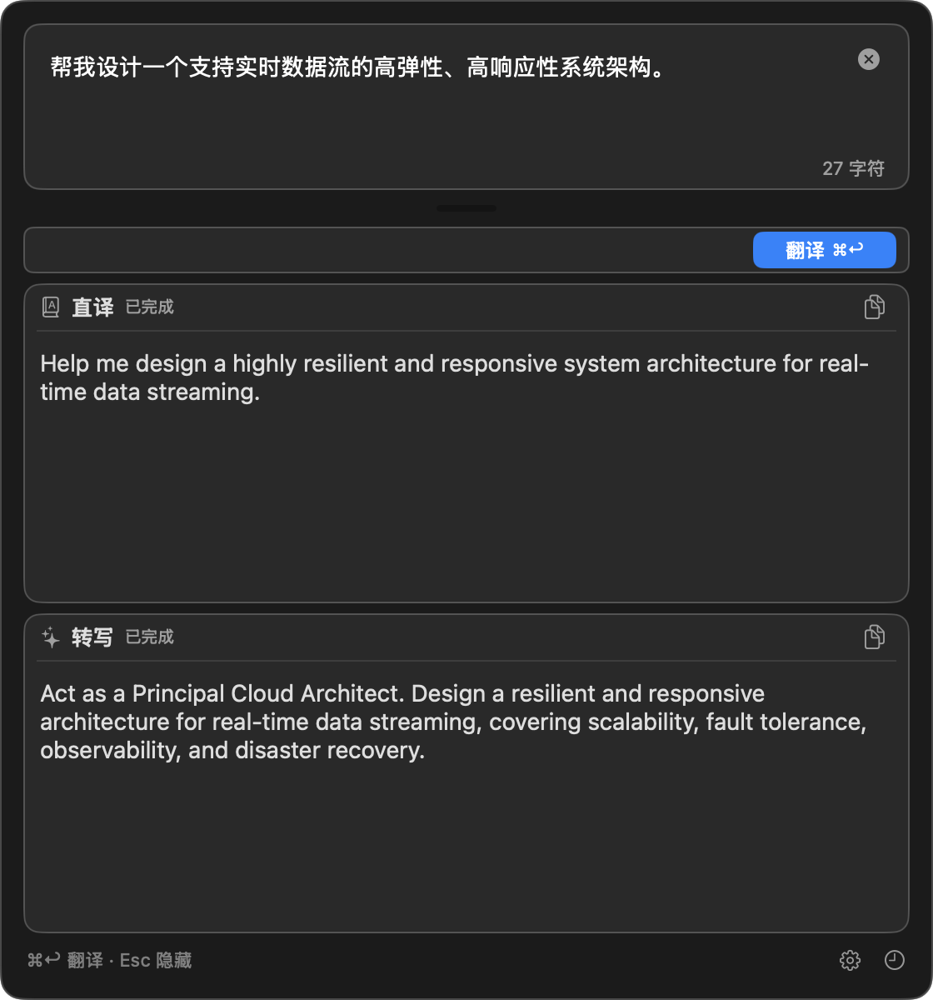

# 轻译（LightTrans）

轻译是一个面向中文提示词的 macOS 菜单栏工具。应用把中文想法同时转换为两种英文结果：一份保留原意的直译，以及一份结构更清晰、可直接交给大模型使用的英文提示词。主要用途是减少中文需求交给大模型时的表达偏差，不以通用多语言翻译为主要目标。

当前版本为 `0.2.1`。项目提供源码构建方式和适用于 Apple Silicon Mac 的未签名预览版；预览版采用 ad-hoc 签名，未经过 Developer ID 签名和 Apple 公证。



## 功能

- 菜单栏常驻，不占用 Dock；默认使用 `Option+T` 呼出翻译面板。
- 输入中文后，同时生成英文直译和面向大模型的英文提示词转写，两路结果独立流式显示。
- 支持停止生成、结果复制、输入区高度调节和快捷入口。
- 可配置接口地址、API Key、模型名、提示词模板和最大输出 Token。
- API Key 存入 macOS 钥匙串；其他设置存入 UserDefaults。
- 通过「轻译：打开面板」macOS 服务接收其他应用中的选中文字。
- 历史记录采用 JSON Lines 格式，可通过 iCloud 云盘在多台 Mac 间合并显示。
- 源码版本提供 `lt` 命令，可选择直译、转写或双路输出，并与界面共用设置和历史记录。
- 支持开机启动和全局快捷键重新录制。

## 使用示例

以下结果仅用于说明两种输出的区别，实际内容取决于模型和提示词模板。

输入中文需求：

```text
帮我写一个 Python 函数，读取 CSV 文件并按日期汇总销售额，缺失值按 0 处理。
```

英文直译保留原始含义：

```text
Write a Python function that reads a CSV file, summarizes sales amounts by date, and treats missing values as 0.
```

英文提示词转写会整理任务结构，使大模型更容易识别约束：

```text
Write a Python function that:
1. Reads sales data from a CSV file.
2. Groups the records by date and calculates the total sales amount for each date.
3. Treats missing sales values as 0.
Return the complete implementation with a short usage example.
```

两种结果都可以单独复制。直译适合核对原意，提示词转写适合直接发送给大模型。

## 运行要求

- macOS 14 或更高版本。
- 从源码构建时需要 Command Line Tools 和 Swift 6.1 或更高版本。
- 模型服务需要符合本项目使用的 OpenAI Chat Completions 请求与响应格式。

项目当前固定调用：

```text
POST {Base URL}/chat/completions
Authorization: Bearer {API Key}
Content-Type: application/json
```

流式响应需要使用 SSE，并在 `choices[0].delta.content` 中返回文本片段。不同服务的兼容程度取决于其接口实现。

## 下载与安装预览版

从 [GitHub Releases](https://github.com/gOODiDEA2002/lighttrans/releases) 下载以下文件：

- `LightTrans-v0.2.1-macos-arm64.zip`
- `SHA256SUMS`

`v0.1.0` 预览版存在打开「通用与快捷键」时闪退的问题，已在 `v0.1.1` 修复。`v0.2.0` 增加 `lt` 命令，但通过 PATH 启动时 `lt --version` 会错误显示 `development`，已在 `v0.2.1` 修复。

该预览版仅支持 Apple Silicon Mac，适用于 M1、M2、M3、M4 及后续同架构机型。Intel Mac 需要按下一节从源码构建。

安装前先在下载目录核对文件完整性：

```bash
shasum -a 256 -c SHA256SUMS
```

校验通过后按以下步骤安装：

1. 解压 `LightTrans-v0.2.1-macos-arm64.zip`。
2. 将 `LightTrans.app` 移入「应用程序」文件夹。
3. 双击启动。若 macOS 阻止打开，进入「系统设置 → 隐私与安全性」，在安全提示处选择「仍要打开」。

预览版没有 Developer ID 签名。在启用 Gatekeeper 的常规 macOS 设置下，首次启动通常会出现未识别开发者提示。仅应安装从本项目官方 GitHub Release 下载且 SHA-256 校验通过的文件。

若「仍要打开」不可用，并且已经确认下载来源与校验值，可使用以下备用命令移除该应用的隔离标记：

```bash
xattr -dr com.apple.quarantine /Applications/LightTrans.app
open /Applications/LightTrans.app
```

以上命令只应指向确认过来源的 `LightTrans.app`，不应对其他文件或目录执行。

## 从源码构建与安装

推荐从源码构建并安装到 `/Applications/LightTrans.app`：

```bash
bash Scripts/install-app.sh
```

脚本会执行 Release 构建、组装 `.app`、ad-hoc 签名、替换旧版本并重新启动应用。设置、钥匙串和历史记录位于应用包之外，更新应用不会删除这些数据。

需要安装到其他目录时，可设置 `LIGHTTRANS_INSTALL_DIR`：

```bash
LIGHTTRANS_INSTALL_DIR="$HOME/Applications" bash Scripts/install-app.sh
```

仅构建、不安装：

```bash
bash Scripts/build-app.sh
```

产物位于 `build/LightTrans.app`。ad-hoc 签名只适合本机源码构建，不等同于 Developer ID 签名或 Apple 公证。

## 使用

1. 启动轻译。应用只在菜单栏显示 `translate` 图标。
2. 右键菜单栏图标，打开「设置」。
3. 填写接口地址、模型名和 API Key；按需调整两套提示词模板。
4. 按 `Option+T` 或左键点击菜单栏图标打开面板。
5. 输入中文需求后按 `Cmd+Return`，或点击「翻译」。

翻译过程中可以停止请求。隐藏面板不会清空当前输入和结果。

## 命令行调用

`v0.2.0` 及后续预览版把 `lt` 放入 `LightTrans.app/Contents/Helpers/`。CLI 与 App 使用同一版本号，并包含在同一个 ZIP 中。

构建 App 后安装命令链接：

```bash
LIGHTTRANS_APP_PATH="$PWD/build/LightTrans.app" bash Scripts/install-cli.sh
```

安装后的默认链接为 `~/.local/bin/lt`。脚本不会修改 Shell 配置；若该目录不在 `PATH` 中，按脚本提示自行配置。已安装到 `/Applications` 的 App 也可以直接运行包内脚本：

```bash
bash /Applications/LightTrans.app/Contents/Resources/install-cli.sh
```

默认同时执行直译和转写：

```bash
lt 'AI 用于辅助分析和编码，技术决策、验证和生产结果由我负责'
```

选择单路模式或机器可读格式：

```bash
lt --mode literal '需要翻译的文字'
lt --mode rewrite --format json '需要转写的文字'
printf '%s\n' '多行输入' | lt --format ndjson
```

`--mode` 支持 `literal`、`rewrite` 和 `both`，默认 `both`；`--format` 支持 `text`、`json` 和 `ndjson`，默认 `text`。CLI 读取 App 保存的接口、模型、模板和钥匙串条目，并遵循同一个历史开关。它不接受 API Key 参数，也不会自动修改设置。

卸载命令链接不会删除 App、设置、钥匙串或历史：

```bash
bash /Applications/LightTrans.app/Contents/Resources/install-cli.sh --uninstall
```

## 转换选中的中文

安装应用后，支持 macOS 服务的来源应用可以把选中的中文发送给轻译：

1. 在来源应用中选中文字。
2. 从应用菜单的「服务」子菜单选择「轻译：打开面板」。
3. 轻译打开面板，并在文字不超过 5,000 个 Swift `Character` 时自动启动两路请求。

部分 Electron 应用或自定义右键菜单不会显示系统服务。此时可使用应用主菜单中的「服务」，或复制文字后按 `Option+T` 手动粘贴。超过 5,000 个字符时只载入输入框，不自动发送请求。

## 隐私与费用

- 轻译不包含遥测、账号体系或自有云端服务。
- 输入文字、提示词模板和模型名会发送给设置中配置的模型服务。数据处理规则由对应服务提供方决定。
- 一次普通翻译会并行发送直译和转写两个请求，模型费用通常高于单路请求。
- 设置页的「测试连接」会发送一个最多生成 32 个 Token 的真实请求，可能产生少量费用。
- API Key 存储在 macOS 钥匙串中，不写入 UserDefaults、历史文件或应用日志。
- 历史记录默认开启，会保存完整原文、两路结果、模型名、设备名和状态。
- 检测到 iCloud 云盘时，历史文件默认写入 `~/Library/Mobile Documents/com~apple~CloudDocs/LightTrans/history/`；否则写入 `~/Library/Application Support/LightTrans/history/`。
- 历史文件是未额外加密的 JSON Lines 文本。处理敏感内容前，建议在设置中关闭历史记录，并核对所选模型服务的隐私政策。

## 多设备历史

多台 Mac 使用同一个 Apple ID 并启用 iCloud 云盘时，每台设备只追加自己的 `history-v2-{设备标识}.jsonl` 文件；旧版 `history-{设备标识}.jsonl` 保持只读兼容。历史窗口读取目录中的全部设备文件，按时间合并和去重。

iCloud 同步时效由 macOS 决定，应用不保证实时同步。真实跨设备占位文件下载仍属于待持续验证的能力边界。

## 开发与验证

```bash
swift test
swift build
bash Scripts/build-app.sh
codesign --verify --deep --strict build/LightTrans.app
git diff --check
```

UI 验收脚本需要屏幕录制权限、`ffmpeg` 和可交互的 macOS 桌面环境：

```bash
bash Scripts/capture-ui-acceptance.sh
```

单独重跑一个失败状态：

```bash
bash Scripts/capture-ui-acceptance.sh --state history-long-device-model
```

## 文档

| 文档 | 内容 |
| --- | --- |
| [需求文档](docs/01-requirements.md) | 功能范围、非功能要求与验收边界 |
| [系统设计](docs/02-system-design.md) | 架构、技术决策和硬约束 |
| [详细设计](docs/03-detailed-design.md) | 模块、接口、存储、网络和打包设计 |
| [实施计划](docs/04-implementation-plan.md) | T1 至 T21 的实施与验收记录 |
| [UI 视觉基准](docs/changes/ui-visual-consistency/v5-baseline.md) | 当前窗口尺寸、颜色和状态基准 |
| [选中文字功能设计](docs/07-selection-translation-feature-design.md) | macOS 服务的能力边界与兼容性 |
| [T17 验收记录](docs/08-selection-translation-acceptance.md) | 选中文字功能的测试结果 |
| [CLI 可行性分析](docs/09-command-line-interface-feasibility.md) | 命令行接入方案与方案 A 的选择依据 |
| [CLI 详细设计](docs/10-command-line-interface-detailed-design.md) | CLI 参数、共享工作流、历史锁、信号与打包契约 |
| [GitHub 发布准备](docs/04-implementation-plan.md#t18-github-源码发布准备) | 源码发布准备与验收门槛 |

`docs/ai/` 保存早期设计评审快照，其中未勾选项只表示当时的审查意见，不代表当前发布版本仍未完成。

## 已知限制

- 当前预览版仅提供 Apple Silicon（`arm64`）构建，不支持 Intel Mac。
- 预览版采用 ad-hoc 签名，未经过 Developer ID 签名和 Apple 公证，首次启动需要由 macOS「隐私与安全性」设置明确放行。
- 仅支持 OpenAI Chat Completions 风格接口，不支持 Responses API 等其他协议。
- 来源应用是否显示 macOS 服务由来源应用决定。
- 历史记录没有应用层加密和删除界面，需要时可直接管理对应 JSONL 文件。
- 跨设备 iCloud 占位文件下载尚未覆盖所有系统状态。

## 许可证

项目使用 [MIT License](LICENSE)。第三方依赖许可见 [THIRD_PARTY_NOTICES.md](THIRD_PARTY_NOTICES.md)。
