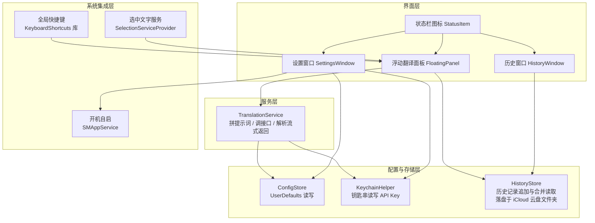
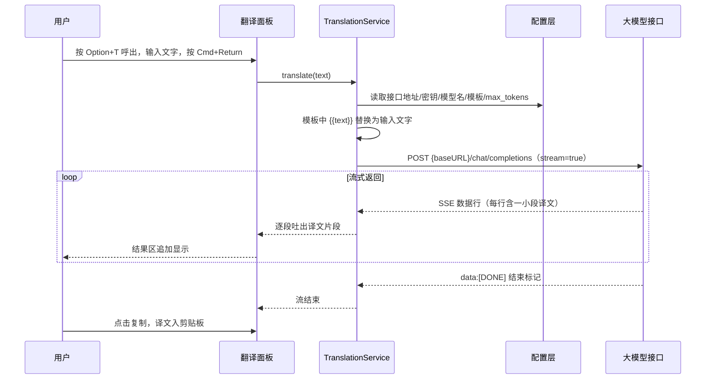
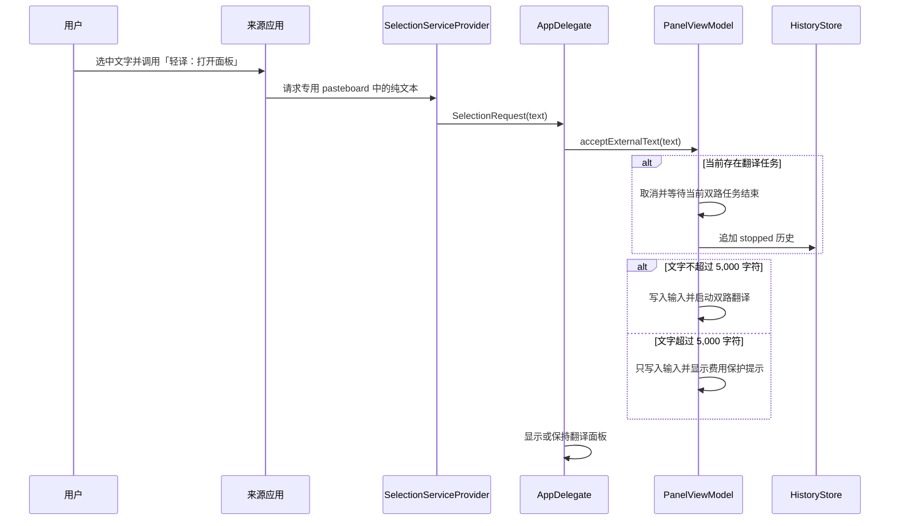

# 系统设计文档

项目名：LightTrans（应用显示名：轻译）
文档版本：v1.2（2026-08-27）
关联文档：01-requirements.md（需求）、03-detailed-design.md（详细设计）、07-selection-translation-feature-design.md（选中文字翻译功能设计）

## 1. 总体架构

应用为单进程 macOS 菜单栏程序，内部分为四层。术语说明：下文的"层"只是代码分组方式，指互相之间通过明确的接口调用、不直接翻动对方内部数据的几组代码。

各层职责：

| 层 | 组件 | 职责 |
| --- | --- | --- |
| 界面层 | AppDelegate、FloatingPanel、TranslatePanelView、SettingsView、HistoryWindowView | 状态栏图标与菜单、面板显示与隐藏、设置窗口、历史窗口、所有用户交互 |
| 服务层 | TranslationService | 渲染提示词模板、构造并发送 HTTP 请求、解析流式返回、错误归类 |
| 配置与存储层 | ConfigStore、KeychainHelper、HistoryStore | 配置项的读写与默认值；API Key 的钥匙串存取；历史记录的追加写入与多设备文件的合并读取 |
| 系统集成层 | KeyboardShortcuts（第三方库）、SMAppService（系统框架）、SelectionServiceProvider（AppKit Services） | 全局快捷键注册与录制；开机自启注册；接收来源应用通过 macOS 服务发送的纯文本选区 |

依赖方向自上而下：界面层调用服务层与配置层；服务层调用配置层；配置层不依赖任何其他层。禁止反向调用。

## 2. 关键技术决策

| 编号 | 决策 | 理由 |
| --- | --- | --- |
| D-1 | 用 Swift + SwiftUI 开发界面，AppKit（macOS 传统界面框架）管理状态栏与浮动面板，两者混合 | SwiftUI 写界面效率高；但纯 SwiftUI 的菜单栏方案 MenuBarExtra 没有公开接口支持"按快捷键以代码方式打开/关闭面板"，而这是本项目核心交互，故状态栏与面板下沉到 AppKit 手工管理，面板内容仍用 SwiftUI 绘制 |
| D-2 | 翻译面板用 NSPanel 浮动窗（Spotlight 样式，屏幕水平居中、垂直约上三分之一处） | 快捷键呼出的工具需要"浮在一切之上、失焦即隐藏、可跨全屏空间显示"，NSPanel 是系统为此类窗口提供的标准类型 |
| D-3 | 大模型接口按 OpenAI Chat Completions 风格（POST /chat/completions，stream 为 true）对接 | 只实现一种明确协议；服务端需要支持 Bearer Token、SSE 与 `choices[0].delta.content`，不承诺兼容所有自称 OpenAI-compatible 的实现 |
| D-4 | 全局快捷键采用第三方库 KeyboardShortcuts（sindresorhus/KeyboardShortcuts） | 系统未提供全局快捷键的现代公开接口；该库封装成熟，自带 SwiftUI 录制控件与 UserDefaults 持久化，接口用法已通过 Context7 于 2026-07-13 核验 |
| D-5 | 工程形态用 Swift Package Manager（Swift 官方的包与构建工具，下称 SPM）+ 打包脚本生成 .app，不建 Xcode 工程文件 | SPM 工程为纯文本、便于 AI 编码与版本管理；菜单栏应用所需的 .app 目录结构与 Info.plist 用脚本生成即可 |
| D-6 | 非敏感配置存 UserDefaults，API Key 存钥匙串 | UserDefaults 为明文属性列表文件，不可存密钥；钥匙串为系统加密存储 |
| D-7 | 开机自启用 SMAppService.mainApp（macOS 13 起的系统官方接口） | 无需辅助程序，一行注册一行注销 |
| D-8 | 源码公开；本机构建产物采用 ad-hoc 签名，不提供预编译下载 | ad-hoc 签名适合源码构建，不等同于 Developer ID 签名和 Apple 公证；公开二进制需要另行设计发布与供应链流程 |
| D-9 | 历史记录经 iCloud 云盘文件夹（`~/Library/Mobile Documents/com~apple~CloudDocs/`，即用户在访达中看到的"iCloud 云盘"）同步，不使用 CloudKit | CloudKit（苹果面向应用的云数据库服务）需要付费开发者账号的授权，本项目无开发者账号；而 iCloud 云盘文件夹对程序而言就是一个由系统自动同步的普通文件夹，写文件不需要任何账号资质 |
| D-10 | 历史文件采用"每设备一个只追加文件（JSON Lines 格式，即每行一条独立 JSON 记录）+ 读取时合并"的结构 | 同步冲突源于多端写同一文件；改为每个文件仅有唯一写入者、且只追加不修改，冲突从结构上消除。合并排序在读取时完成，代价可忽略（个人翻译量级） |
| D-11 | 一次翻译产出两段结果（直译 + 转写），对应两个可各自配置的提示词，两路请求并行发出、各自流式显示（增量 v1.1，详见详细设计第 11 节） | 直译看字面译法、转写做提示词工程改写，二者对同一原文互不依赖；并行发出让两段同时到达，用户无需等第一段结束。代价是单次翻译发两个请求、费用约翻倍，个人低频使用可接受 |
| D-12 | 选中文字的第一阶段入口采用主应用声明的 macOS 服务，只接收纯文本，不返回替换内容 | macOS 服务能通过请求专用 pasteboard 传递选区，不需要模拟复制或申请「辅助功能」权限；无返回值服务也不需要来源应用等待模型结果 |
| D-13 | 外部选区采用「最新请求优先」；已有翻译先停止并写入 `stopped` 历史，再开始新请求 | 直接取消并递增现有代次会让旧任务跳过历史写入；先完成停止状态保存可维持 FR-10 的完整记录规则 |
| D-14 | 选区不超过 `5,000` 个 Swift `Character` 时自动执行双路翻译；超过时只载入面板 | 现有 `maxTokens` 只限制结果长度，不能阻止误选长文产生两路输入费用；字符数判断无需引入模型专属分词依赖 |

## 3. 核心数据流

一次翻译的完整链路：

说明：SSE（Server-Sent Events）是一种服务器分批推送文本的约定格式，响应体由若干以 `data: ` 开头的行组成，`data: [DONE]` 表示结束。解析细节见详细设计第 6 节。

翻译结束后（完成、手动停止或失败），面板将本次的原始输入、输出、状态等信息交给 HistoryStore 追加写入本机专属的历史文件；该文件位于 iCloud 云盘文件夹内，由系统自动同步至其他电脑。历史窗口打开时读入文件夹内全部设备的历史文件并按时间合并展示。细节见详细设计第 10 节。

选中文字触发第一阶段服务时，数据流如下：

## 4. 铁律清单（硬约束，方案与编码不得违反）

| 编号 | 约束 | 出处 |
| --- | --- | --- |
| L-1 | 运行环境为本机 macOS 15.7.4；最低部署目标定为 macOS 14 | `sw_vers` 实测，2026-07-13 |
| L-2 | Info.plist 必须设 LSUIElement 为 true（应用不出现在 Dock）；由此设置窗口打开前必须先调用 NSApp.activate，否则窗口不获焦、无法输入 | Apple 平台惯例，LSUIElement 应用的已知行为 |
| L-3 | KeyboardShortcuts 库接口：`KeyboardShortcuts.Name("id", default: .init(.t, modifiers: [.option]))` 定义默认快捷键；`KeyboardShortcuts.events(for:)` 异步序列监听；`KeyboardShortcuts.Recorder` 为 SwiftUI 录制控件 | Context7 文档核验，2026-07-13；参数标签经 T1 实测订正：`from: "2.0.0"` 解析到的发布版为 2.4.0，其初始化器为 `init(_:default:)`（Context7 展示的 `initial:` 为未发布版改名，尚未进入任何 2.x 发布版），故以 `default:` 为准 |
| L-4 | OpenAI 兼容流式接口：请求体含 `stream: true`；响应为 SSE，译文片段位于每条 JSON 的 `choices[0].delta.content`；`data: [DONE]` 为结束标记 | OpenAI API 公开规范 |
| L-5 | API Key 只能经 KeychainHelper 读写（kSecClassGenericPassword 类型），禁止出现在 UserDefaults、日志与任何源码文件中 | 需求 FR-7 |
| L-6 | 提示词模板占位符固定为 `{{text}}`，替换采用纯字符串替换，不做任何模板语法解析 | 保持实现最简 |
| L-7 | 无付费开发者账号：禁止使用任何需要 iCloud 授权（entitlement）的能力（CloudKit、NSUbiquitousKeyValueStore、专属 iCloud 容器等），历史同步只允许走 iCloud 云盘文件夹的普通文件读写 | 需求文档第 2 节；苹果规定 iCloud 授权仅对付费开发者账号开放 |
| L-8 | 历史文件单写者原则：每台设备只允许写入以本机设备标识命名的历史文件，永远只追加、不修改、不删除；禁止任何跨设备写同一文件的实现 | 决策 D-10，消除同步冲突的结构性保障 |
| L-9 | 目标机器不保证安装完整 Xcode，构建流程不得依赖 `PreviewsMacros`。`KeyboardShortcuts 2.4.0` 固定到修订 `1aef8557`，构建前用版本匹配的补丁删除 `Recorder.swift` 中仅供开发预览的三个 `#Preview` 块，运行时代码不得改动 | 2026-07-15 清理 `.build` 后实测：未处理预览代码时 Command Line Tools 构建失败；删除预览块后干净构建通过 |
| L-10 | FR-12 第一阶段只接收纯文本，不声明服务返回类型，不读取或修改通用剪贴板，不申请「辅助功能」权限 | FR-12、选中文字翻译功能设计 R-1、R-5 |
| L-11 | 自动翻译上限固定为 `5,000` 个 Swift `Character`；超出时只载入原文，不截断、不自动请求 | 选中文字翻译功能设计 R-3 |
| L-12 | 新服务请求到达时，正在进行的任务必须先以 `stopped` 状态完成历史写入；禁止直接用新代次使旧任务跳过保存 | 决策 D-13、选中文字翻译功能设计 R-4 |
| L-13 | Terminal、iTerm2 和其他终端应用永久禁止自动粘贴和原位替换 | 选中文字翻译功能设计 R-6 |

## 5. 假设与验证结论

| 编号 | 假设 | 验证方式 | 不成立时的备选 |
| --- | --- | --- | --- |
| A-1 | NSPanel 设为不抢占激活（nonactivatingPanel）并重写 canBecomeKey 后，输入框可正常输入中文（含输入法候选） | 实施计划任务 T5 中真机验证（结论：成立，中文输入法含候选窗正常，无需备选） | 改为常规激活式面板（呼出时激活本应用，隐藏时归还焦点） |
| A-2 | KeyboardShortcuts 库支持最低部署目标 macOS 14 | T1 结论：成立；当前锁定 2.4.0 与修订 `1aef8557` | 锁定该库的兼容旧版本，或将部署目标提高到其要求的版本（本机 15.7.4，余量充足） |
| A-3 | SPM 构建产物经脚本打包成 .app 后，SMAppService 开机自启注册可用（该接口对应用所在路径可能有要求） | 任务 T9 真机验证：注册后重新登录检查（结论：成立，应用置于 /Applications 后开关注册无错误、系统登录项可见、注销重登自动启动） | 退化为提示用户手动将应用加入"登录项"，开关仅作跳转引导 |
| A-4 | 非沙盒的 ad-hoc 签名应用可直接读写 iCloud 云盘文件夹路径（`~/Library/Mobile Documents/com~apple~CloudDocs/`），至多出现一次性的系统授权弹窗 | 任务 T7 真机验证：写入后在访达"iCloud 云盘"中确认文件出现并开始同步（结论：成立，直接读写成功、无授权弹窗；退化到本机目录亦经强制走本机分支验证通过） | 改为将历史目录设为用户可选路径，由用户手动选到 iCloud 云盘内；或退化为仅存本机 |
| A-5 | 其他设备同步来的历史文件若被系统"优化储存空间"驱逐为云端占位（本地只留 `.icloud` 占位文件），应用可触发下载或至少能识别并提示 | 任务 T7 验证：对占位文件调用 FileManager 的下载接口观察行为（结论：可测部分成立，`.icloud` 占位文件被识别、计入 pendingDevices、调用 startDownloadingUbiquitousItem 不崩溃；真实跨设备占位下载需第二台设备，标注待验，同 FR-11） | 历史窗口对未下载的设备文件显示"该设备记录待从 iCloud 下载"提示，引导用户在访达中下载 |
| A-6 | 主应用声明的 `NSServices` 能被系统识别，并能在轻译未运行时启动 `LSUIElement` 应用 | T17 结论：成立；Release 安装、服务刷新和 Safari 冷启动通过 | 评估独立 `.service` 包；未经设计评审不实施 |
| A-7 | 不授予「辅助功能」权限时，目标应用可以把纯文本选区发送给第一阶段服务 | T17 结论：在已验收应用中成立；来源应用不暴露系统服务时按兼容性边界处理 | 对不支持的应用保留手动复制流程，不自动改用 Accessibility API |
| A-8 | 服务请求可以在应用完成面板初始化后安全切换到主线程处理 | T17 结论：成立；冷启动、后台运行和面板已显示状态通过 | 调整服务注册时机，并使用单条冷启动请求缓存 |
| A-9 | 多行文字、Emoji、组合字符和中英文混排可通过纯文本 pasteboard 无损传递 | T17 结论：成立；单元测试与真机样例通过 | 记录不兼容应用；禁止静默截断或替换字符 |
| A-10 | Terminal 和 iTerm2 的只读选区能调用无返回值文本服务 | T17 结论：成立；人工补验通过 | 标记为不支持，保留复制后呼出面板的流程 |
| A-11 | 当前双路任务取消后，在不递增代次的前提下等待协调任务结束，可以稳定写入一条 `stopped` 历史 | T17 结论：成立；任务生命周期测试与真实流式替换通过 | 先重构任务结束协议，不接入正式服务入口 |

## 6. 模块间接口概览

- 界面层到服务层只有一个模型请求入口：`TranslationService.translate(text:template:) -> AsyncThrowingStream<String, Error>`（一个会陆续吐出字符串片段、可能中途报错的异步序列）。
- 服务层到配置层只读不写；设置窗口是唯一的配置写入方。
- 历史读写只有两个入口：`HistoryStore.append(record:)`（翻译面板在翻译结束时调用）与 `HistoryStore.loadAll() -> [HistoryRecord]`（历史窗口打开与刷新时调用）。
- 错误统一为 `TranslationError` 枚举，由服务层归类、界面层转为中文文案，映射表见详细设计第 7 节。历史写入失败不影响翻译主流程，仅记日志。
- 来源应用到系统集成层只有一个入口：`SelectionServiceProvider` 从请求专用 pasteboard 读取纯文本并生成不可变请求；它不得调用模型接口或写历史。
- `AppDelegate` 接收选区请求并交给 `PanelViewModel.acceptExternalText(_:)`；任务停止、历史保存、长文本判断和双路启动均由 ViewModel 管理。
