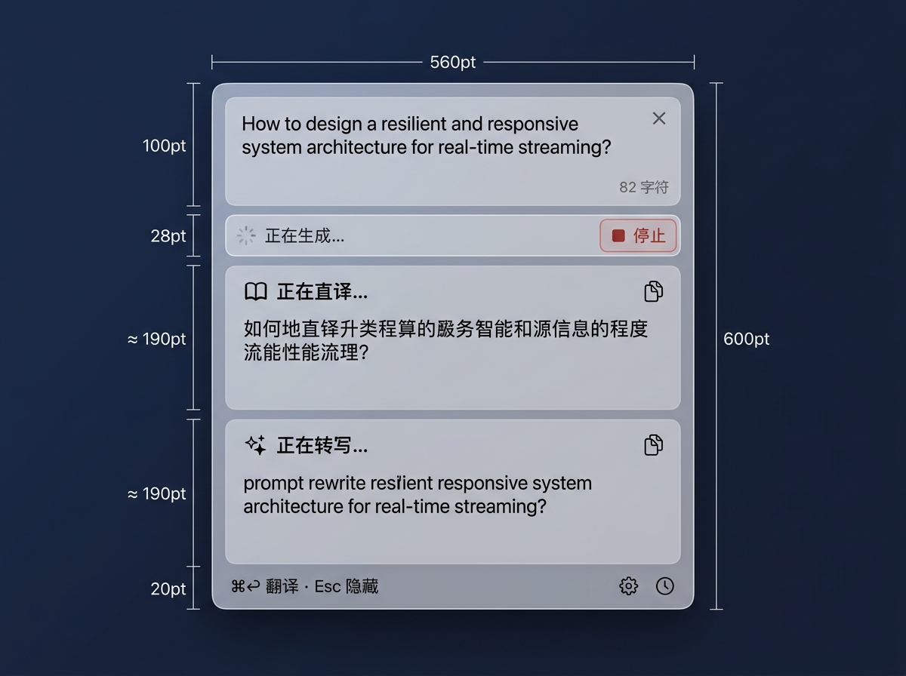
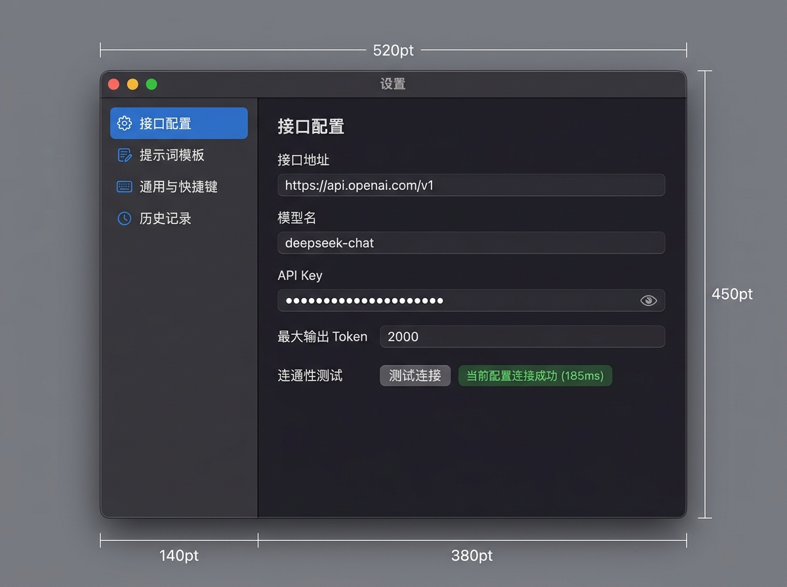
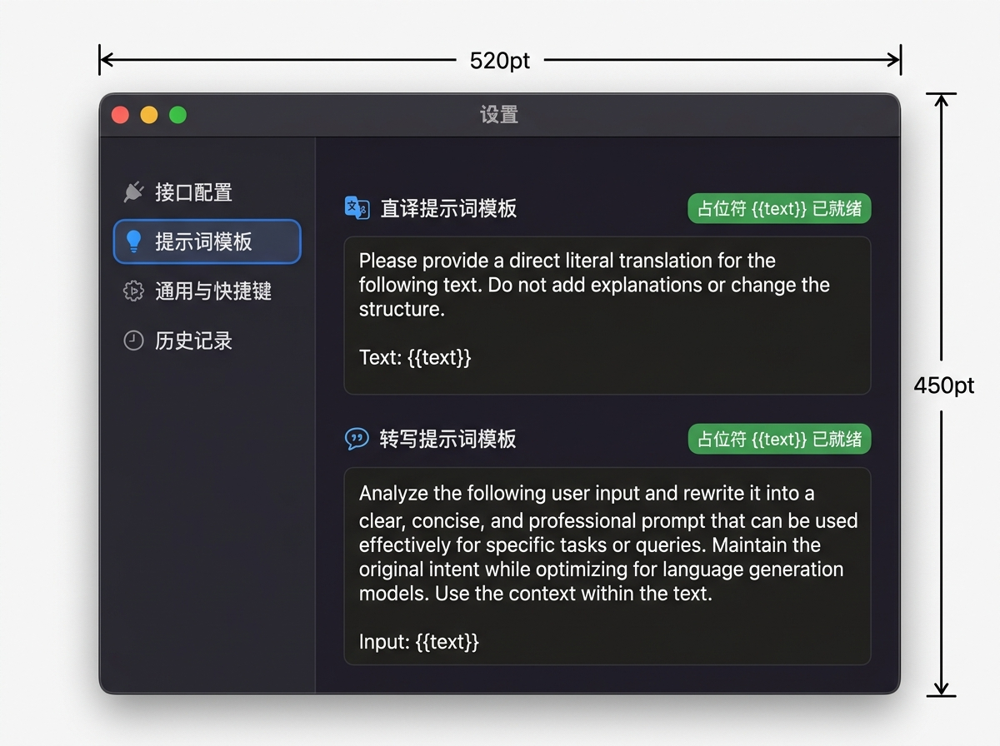
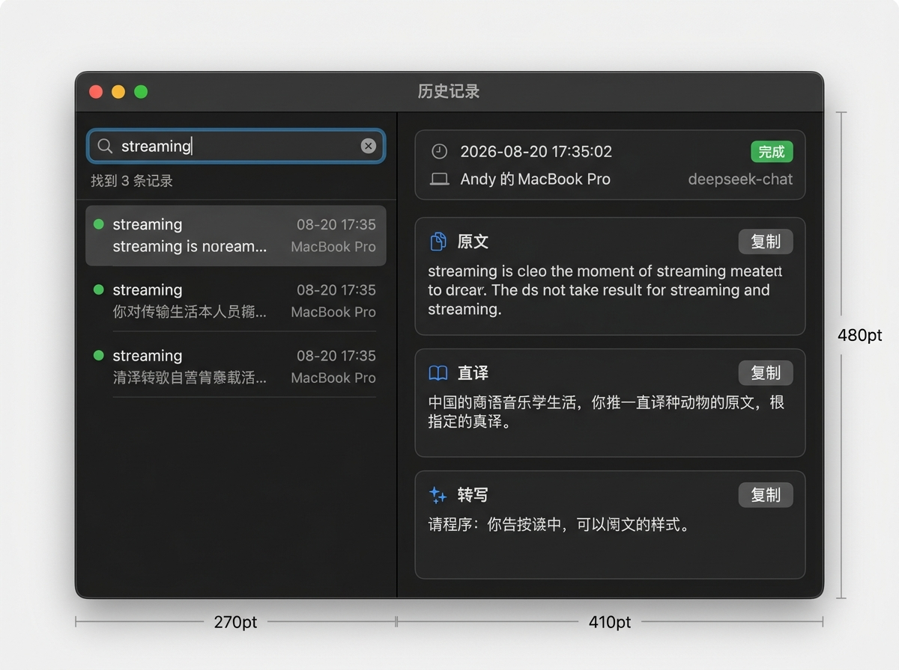

# UI 界面优化方案与视觉设计规范（v4.0）

项目名：LightTrans（应用显示名：轻译）
文档版本：v4.0（2026-08-21）
状态：已实施并验收
关联文档：01-requirements.md（需求）、02-system-design.md（系统设计）、03-detailed-design.md（详细设计）、ai/2026-08-20-ui-optimization-proposal-review-v4.md（评审报告）

---

## 1. 背景与核心决策收敛

针对 ChatGPT v3 评审报告中指出的 6 项阻断性问题，本方案进行了彻底收敛与技术决断：

1. **真实尺寸与垂直空间预算严格闭合（P1-1）**：面板尺寸固定为 `560 × 600 pt`，采用真实的垂直像素预算，两张结果卡平分剩余高度，杜绝尺寸溢出。
2. **设置导航唯一化（P1-2）**：统一采用固定 4 分类的左侧列表导航（接口配置、提示词模板、通用与快捷键、历史记录），窗口固定为 `520 × 450 pt`，右侧仅渲染当前选中项。
3. **架构与任务生命周期简化（P1-3）**：**放弃单路局部重试**，保持一次翻译为一个不可分割的协调任务（`generation` 代次控制与只追加历史记录契约保持极简可靠）；单路失败展示红色文案，用户可按 `⌘↩` 整体重新翻译。
4. **直达调用采用闭包依赖注入（P1-4）**：`TranslatePanelView` 声明 `onOpenSettings` 与 `onOpenHistory` 闭包，由 `AppDelegate` 创建时注入自身私有方法，避免通知广播或强耦合。
5. **搜索选择联动规则闭合（P1-5）**：`selectedRecord` 严格由 `filtered` 解析。筛选后旧选中项仍在结果中则保留；若被过滤且有其他结果则自动选择首项；无结果时置 `nil` 并渲染空状态。
6. **权威文档同步写回（P1-6）**：本方案同步增补写回 `docs/03-detailed-design.md`（第 13 节）与 `docs/04-implementation-plan.md`（任务 T12–T14），确保代码改动有据可循。

---

## 2. 视觉设计稿（Visual Mockups）

### 2.1 浮动翻译面板（560 × 600 pt）



#### 垂直布局尺寸预算表（精确至 600 pt 满高）：
- **外边框与内边距**：窗体 `560 × 600 pt`，14pt 圆角，四周内边距 `14 pt`（内部可用高度 `572 pt`，可用宽度 `532 pt`）。
- **组件垂直排版与高度**：
  1. 输入卡片：动态可调高度 `inputHeight`（范围 `[70 pt, 240 pt]`，默认 `100 pt`）。
  2. 间距 1：`6 pt`。
  3. 拖拽手柄（Resize Handle）：固定高度 `10 pt`（`36 × 4 pt` 胶囊，鼠标悬停 `.resizeUpDown`，双击复位 `100 pt`）。
  4. 间距 2：`6 pt`。
  5. 操作栏：固定高度 `28 pt`（左侧 ProgressView +「正在生成…」；右侧「停止」带 `stop.fill` 图标与红底 tint，空闲时为「翻译 ⌘↩」）。
  6. 间距 3：`6 pt`。
  7. 直译与转写结果卡片：双卡平分剩余高度，单卡高度计算公式为 `(484 - inputHeight) / 2`。
     - `inputHeight = 70 pt` 时：单张结果卡高度约为 `207 pt`；
     - `inputHeight = 100 pt`（默认）时：单张结果卡高度约为 `192 pt`；
     - `inputHeight = 240 pt`（最大）时：单张结果卡高度约为 `122 pt`（保持独立 ScrollView 滚动）；
  8. 间距 4：`6 pt`（双卡之间）。
  9. 间距 5：`6 pt`（转写卡与底部栏之间）。
  10. 底部辅助栏：固定高度 `20 pt`（左侧「⌘↩ 翻译 · Esc 隐藏」；右侧 `gearshape` 与 `clock` 直达按钮）。
- **校验总高度**：`inputHeight + 10 (手柄) + 28 (操作栏) + (484 - inputHeight) (双卡) + 20 (底部栏) + 30 (5个间距) + 28 (上下padding) = 600 pt`，严格闭合于 `600 pt` 窗口。

---

### 2.2 偏好设置窗口（520 × 450 pt）

设置窗口采用固定侧边栏分类导航（宽度 `140 pt`，内容区 `380 pt`），两张设计稿严格保持相同导航分类、顺序与窗口标题。

#### (1) 「接口配置」页面


#### (2) 「提示词模板」页面（双模板完整展示）


#### 视觉与交互规范：
- **分类导航项（固定 4 项）**：
  1. 接口配置（`network`）
  2. 提示词模板（`square.and.pencil`）
  3. 通用与快捷键（`command`）
  4. 历史记录（`clock.arrow.circlepath`）
- **接口配置**：
  - 接口地址与模型名均为标准 `TextField`，支持任意 OpenAI 兼容服务。
  - API Key 为 `SecureField`，右侧仅保留眼睛图标（`eye` / `eye.slash`）切换明暗文，无冗余复制图标。
  - 连通性测试：点击「测试连接」使用当前正在编辑的值发起 `max_tokens: 32` 探测请求（超时 10 秒，支持取消，**绝对不写历史记录**）。界面展示「当前配置连接成功 (xxx ms)」或具体错误；输出达到上限且正文为空时，提示测试输出 Token 不足。提示文本注明「测试将发送极简请求，可能产生极微量 API 费用」。
- **提示词模板**：
  - 同页纵向完整展示「直译提示词模板」与「转写提示词模板」两个卡片。
  - 头部配对应图标与 `{{text}}` 校验徽章（绿色「占位符 {{text}} 已就绪」或橙色「未检测到占位符」）。
  - 编辑区使用系统正文字体，保持良好的自然语言阅读与编辑体验。

---

### 2.3 历史记录窗口（680 × 480 pt）



#### 视觉与交互规范：
- **左右分栏**：左侧列表 `270 pt`，右侧详情 `410 pt`。
- **左侧记录列表**：
  - 顶部搜索栏内置「找到 N 条记录」计数与一键清空。
  - 列表项摘要最多 2 行（`.lineLimit(2)`）。
  - 状态标识：固定左侧微型圆点（绿/橙/红），并附带 VoiceOver 无障碍标签（「状态：完成」等）。
  - 设备名称使用低对比度次要文本（如「MacBook Pro」），消除亮蓝色胶囊视觉噪音。
- **右侧详情区**：
  - 顶部元数据 2 行网格：
    - Row 1: 时间 + 状态 Badge。
    - Row 2: 设备（`laptopcomputer`）+ 模型（`cpu`），使用 `.lineLimit(1).truncationMode(.tail)` 搭配 `.help()` 悬浮提示，长设备名/模型名稳定容纳。
  - 正文分 3 个圆角卡片（原文、直译、转写），统一采用 SF Symbols 单色渲染，各带独立复制按钮。
- **搜索与选中联动**：
  - 筛选后若原选中记录仍在 `filtered` 中则保持；若被过滤但 `filtered` 非空则自动选择首项；`filtered` 为空时选中置 `nil` 并显示空状态占位。

---

## 3. 技术实现与架构绑定

### 3.1 闭包注入直达窗口（对齐 P1-4）

```swift
// TranslatePanelView 声明
struct TranslatePanelView: View {
    @ObservedObject var viewModel: PanelViewModel
    let onOpenSettings: () -> Void
    let onOpenHistory: () -> Void
    // ...
}

// AppDelegate 创建 RootView
let rootView = TranslatePanelView(
    viewModel: panelViewModel,
    onOpenSettings: { [weak self] in self?.openSettings() },
    onOpenHistory: { [weak self] in self?.openHistory() }
)
```

### 3.2 简化的任务生命周期（对齐 P1-3）

- 放弃局部单路重试，保留 `PanelViewModel.startTranslate()` 统一协调。
- 无论单路成功还是失败，均统一按原设计规则在两路结束后写入一条聚合历史记录；若需重试，用户直接按 `⌘↩` 触发新一轮全局翻译（`generation += 1`）。

### 3.3 连通性测试接口（对齐 P2-9）

```swift
// TranslationService 新增轻量探测接口
func testConnection(baseURL: String, model: String, apiKey: String) async throws -> TimeInterval {
    // 构造 max_tokens: 32 请求，不写入 HistoryStore，超时 10 秒
}
```

### 3.5 文字输入框下拉放大（Resize Handle）规范

- **调节区间**：默认高度 `100 pt`，动态拖拽区间限制为 `[70 pt, 240 pt]`。
- **拖拽手柄（Grabber）**：
  - 位于输入卡片底部中心，采用 `36 × 4 pt` 半透明圆角胶囊横条；
  - 鼠标悬停（Hover）时高亮，光标切换为垂直调整光标（`.resizeUpDown`）；
  - 支持 `DragGesture` 平滑动态拉伸；双击手柄快速弹性动画复位至默认 `100 pt`。
- **空间联动**：输入框高度增大时，下方两段结果卡片平分剩余空间并保持 `ScrollView` 独立平滑滚动，总高度严格闭合于 `560 × 600 pt` 窗口内。

### 3.6 菜单栏图标（Status Item Icon）精细化规范

- **图形选型**：首选 `translate`（一级入口优先表达「翻译」语义），回退 `character.bubble`。`sparkles.rectangle.stack` 作为已评估但未采用的候选方案：双结果结构属于二级语义，不适合作为一级入口的首要表达。
- **渲染契约**：
  - 必须设置 `isTemplate = true`，自动支持系统深浅色壁纸与高亮反相；
  - 应用 `NSImage.SymbolConfiguration(pointSize: 14, weight: .medium)`，呈现锐利现代的菜单栏视觉质感。

### 3.7 跨窗口视觉一致性规则

以下视觉语言在翻译面板、设置窗口和历史窗口中保持统一：

1. **外层卡片容器**：圆角 8–10 pt，`controlBackgroundColor.opacity(0.4–0.6)` 填充，`Color.primary.opacity(0.06–0.08)` 描边 1 pt。
2. **标题栏**：SF Symbols 单色图标 12 pt + 标题 13 pt semibold + 操作按钮靠右。
3. **分隔线**：使用系统 `Divider()` 或语义色 `Color.primary.opacity(0.06)` 描边替代。
4. **正文区**：系统正文字体（13–14 pt），支持文本选中（`.textSelection(.enabled)`），独立 ScrollView 滚动。
5. **状态色**：完成绿（`.green`）、停止橙（`.orange`）、失败红（`.red`）；状态点（6 pt 圆形）附带 VoiceOver 无障碍标签。
6. **复制反馈**：紧凑方形图标按钮（`doc.on.doc`），复制后原位切换绿色 `checkmark`，不显示"已复制"文字，1.5 秒后还原。tooltip 在未复制时显示"复制{标题}"，复制后显示"已复制"。

---

## 4. 实施任务分解（UI-1 至 UI-5）

| 任务编号 | 任务名称 | 涉及文件 | 主要工作内容 | 验收标准 |
| --- | --- | --- | --- | --- |
| **UI-1** | 浮动翻译面板重构 | `FloatingPanel.swift`<br>`TranslatePanelView.swift`<br>`PanelViewModel.swift`<br>`AppDelegate.swift` | 1. 窗体应用 NSVisualEffectView 材质、14pt 圆角与微高光。<br>2. 输入区卡片化，增加一键清空（xmark）与字符统计；Esc 严格隐藏。<br>3. 操作栏：生成中切换为警示样式「停止」按钮。<br>4. 双路独立状态展示与卡片平分剩余高度。<br>5. 复制平滑动效；底部工具栏通过闭包直达设置与历史。 | 1. 560 × 600 尺寸下各控件完美吻合布局预算表，无溢出或截断。<br>2. 生成中主按钮为停止，点击立即中断两路输出。<br>3. 按 Esc 稳定隐藏面板；点击清空仅清空输入。<br>4. 底部图标点击正常唤起并获焦设置/历史窗口。 |
| **UI-2** | 设置窗口分页与连通测试 | `SettingsView.swift`<br>`TranslationService.swift` | 1. 改造为固定 4 项侧边栏分类导航，窗口固定在 520 × 450 pt。<br>2. 接口配置：模型名自由输入，API Key 明暗文切换。<br>3. 实现不写历史的连通性测试（`max_tokens: 32`）与耗时反馈。<br>4. 提示词模板：同页纵向完整展示「直译」与「转写」双模板及占位符校验徽章。 | 1. 侧边栏分类切换平滑，右侧表单无多余裁切。<br>2. 测试连接能准确给出毫秒耗时或错误，且确认不产生历史记录。<br>3. 直译与转写双模板均能正常编辑并持久化。 |
| **UI-3** | 历史窗口密度与详情重构 | `HistoryWindowView.swift` | 1. 列表项紧凑化（最多 2 行摘要），增加无障碍语义色彩状态指示点，设备名降噪。<br>2. 搜索栏结果计数与搜索/刷新自动联动选中项（不存在则首选，无结果置空）。<br>3. 详情区元数据 2 行网格重排，原文/直译/转写分卡片排版与独立复制。 | 1. 680 × 480 尺寸下左右分栏比例协调，长设备名/模型名不换行截断（尾部省略+tooltip）。<br>2. 搜索过滤与空状态切换自然，无旧详情残留。<br>3. 详情各卡片独立复制与状态展示准确。 |
| **UI-4** | 输入框下拉放大与菜单栏图标 | `TranslatePanelView.swift`<br>`AppDelegate.swift` | 1. 输入卡片底部增加拖拽手柄，支持 70–240 pt 动态高度调节与双击复位。<br>2. 状态栏图标采用 `translate` 模板图标（点大小 14pt，中等字重），保留 `character.bubble` 回退。 | 1. 拖拽手柄可平滑调节输入框高度，双击弹性复位 100 pt，结果区自适应平分无溢出。<br>2. 菜单栏图标呈现为清晰的 `translate` 图标，`character.bubble` 回退可用；深浅色切换及点击高亮正常。 |
| **UI-5** | 跨窗口视觉一致性与交互精修（v4.0/T16） | `TranslatePanelView.swift`<br>`SettingsView.swift`<br>`HistoryWindowView.swift`<br>`AppDelegate.swift` | 1. 操作栏圆角容器、结果区完整卡片、紧凑复制图标按钮、拖拽手柄无障碍。<br>2. 设置测试连接可取消（代次令牌防竞态）、API Key 眼睛按钮入单一边框容器、双模板完整卡片。<br>3. 历史搜索归左栏、列表两层信息、详情完整卡片、三种空状态、设备名不溢出。 | 1. 三窗口卡片/复制/状态视觉语言一致。<br>2. 测试取消后无迟到结果覆盖；API Key 按钮在边框内。<br>3. 240 pt 左栏内长设备名尾部省略不溢出。<br>4. 光标手柄悬停/离开/隐藏/Esc 行为一致。 |

---

## 5. 约束与系统保证

1. **依赖铁律**：全部改动仅使用 SwiftUI 5（macOS 14+）与 AppKit 原生能力，零第三方 Package 引入。
2. **存储契约不变**：`ConfigStore`、`KeychainHelper`、`HistoryStore` 数据格式与同步完全兼容。
