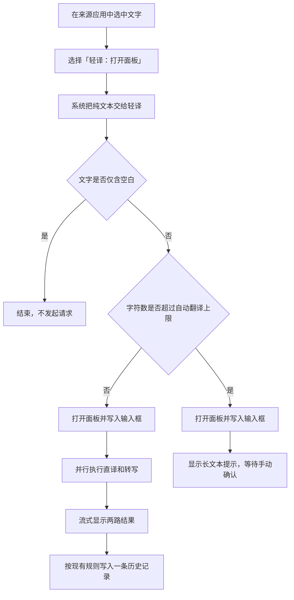

# 选中文字翻译功能设计

项目名：mac-translator（应用显示名：轻译 / LightTrans）
文档版本：v1.0（2026-08-22）
状态：已确认，待实施
关联文档：01-requirements.md（需求）、02-system-design.md（系统设计）、03-detailed-design.md（详细设计）、04-implementation-plan.md（实施计划）

---

## 1. 文档目的

本文定义轻译处理其他 macOS 应用所选文字时的产品行为、阶段范围、系统边界、异常处理和验收标准。

本设计已于 2026-08-22 确认。第一阶段范围已同步到需求文档、系统设计、详细设计和实施计划；T16 已验收并提交，当前尚未开始 T17 编码。

## 2. 背景与产品结论

现有轻译需要先呼出面板，再手动输入或粘贴文字。阅读网页、文档、终端输出和聊天消息时，这一流程包含重复的复制、切换和粘贴操作。

本功能采用 macOS「服务（Services）」接收来源应用中的选中文字，不尝试向所有应用注入自定义顶层右键菜单。入口通常出现在来源应用的右键菜单「服务」区域或应用菜单的「服务」子菜单；具体位置由来源应用决定。

产品按三个阶段推进：

| 阶段 | 功能 | 产品定位 | 当前结论 |
| --- | --- | --- | --- |
| 第一阶段 | 选中文字后打开轻译面板，自动执行直译和转写 | 默认入口 | 纳入下一次实施范围 |
| 第二阶段 | 直译并复制、转写并复制 | 高频快捷动作 | 完成第一阶段并验证使用需求后实施 |
| 第三阶段 | 在受支持的可编辑控件中替换原选区 | 实验性增强 | 先完成兼容性原型验证，不承诺实施 |

第一阶段不需要「辅助功能」权限，不修改通用剪贴板，也不尝试识别来源控件能否编辑。

## 3. 目标与非目标

### 3.1 产品目标

1. 在支持 macOS 服务的应用中，把选中文字直接交给轻译。
2. 第一阶段复用现有面板、双路流式生成、停止、错误提示、复制和历史记录能力。
3. 保持行为可见、可取消、可恢复，不在后台静默覆盖原文或剪贴板。
4. 对超长选区增加费用保护，避免一次误选触发两路高成本请求。
5. 为后续单路快捷动作和原位替换保留清晰的扩展边界。

### 3.2 本次不做

- 不保证服务项出现在所有应用的顶层右键菜单。
- 不开发 Safari、Chrome、Firefox 等浏览器专属扩展。
- 不监听或持续读取通用剪贴板。
- 不通过模拟 `Command+C` 获取选中文字。
- 不在终端中自动粘贴、替换或执行生成结果。
- 不在第一阶段申请「辅助功能」「输入监控」或「自动化」权限。
- 不新增提示词类型、语言自动识别规则或模型配置。
- 不改变现有面板尺寸、视觉基准和 Esc 隐藏行为。

## 4. 已确认事实与硬约束

| 编号 | 事实或约束 | 依据 | 对本设计的影响 |
| --- | --- | --- | --- |
| C-1 | 轻译是 `LSUIElement` 菜单栏应用，不显示在 Dock 和 `Command+Tab` 中 | 需求 FR-1、系统设计 L-2、当前 `Info.plist` | 服务请求应复用现有菜单栏进程和浮动面板，不新增普通主窗口 |
| C-2 | 一次常规翻译并行执行直译和转写，两路分别流式显示 | 系统设计 D-11、详细设计第 11 节 | 第一阶段继续使用双路模式，一次操作产生两次模型请求 |
| C-3 | `PanelViewModel.startTranslate()` 当前负责双路任务、取消、状态和历史写入 | 当前代码 | 第一阶段应通过面板 ViewModel 接收外部文本，不另建重复的翻译实现 |
| C-4 | `AppDelegate` 当前持有状态栏、面板和 `PanelViewModel` | 当前代码 | macOS 服务入口由 `AppDelegate` 完成装配，再把选中文字交给面板 |
| C-5 | 面板隐藏不清空内容；Esc 只隐藏面板 | 需求 FR-9、详细设计第 13.1 节 | 通过服务触发后，隐藏面板不停止正在进行的翻译 |
| C-6 | 历史记录只追加，一次双路翻译写入一条记录 | 需求 FR-10、系统设计 L-8、详细设计第 11.4 节 | 服务触发的翻译必须遵守相同存储规则 |
| C-7 | macOS 服务使用请求专用 pasteboard 传递选区，可独立于通用剪贴板 | Apple Services 文档 | 第一阶段不读取或覆盖通用剪贴板 |
| C-8 | 服务菜单不支持应用自定义子菜单，服务项名称必须独立可辨认 | Apple Services 文档 | 所有入口统一使用「轻译：动作」命名 |
| C-9 | 带返回值的服务默认等待 30 秒，来源应用是否接受返回值取决于其文本控件 | Apple Services 文档 | 原位替换不得与第一阶段一起实现 |
| C-10 | T15/T16 已定义面板、设置、历史和菜单栏的视觉基准 | 详细设计第 13 节、`docs/changes/ui-visual-consistency/v5-baseline.md` | 本功能不得改变现有窗口尺寸和视觉基准 |

## 5. 术语

| 术语 | 定义 |
| --- | --- |
| 选中文字 | 来源应用在触发服务时交给系统的非空纯文本快照 |
| 来源应用 | 当前提供选中文字的 macOS 应用，例如 Safari、TextEdit、Terminal 或 Cursor |
| 服务入口 | 通过 `NSServices` 注册、由来源应用菜单提供的系统级动作 |
| 面板模式 | 打开现有轻译面板，显示输入、直译、转写、状态和操作按钮 |
| 快捷复制模式 | 只执行直译或转写中的一路，成功后尝试写入通用剪贴板 |
| 原位替换 | 把生成结果写回来源应用原来的可编辑选区 |

「转写」继续沿用现有定义：把原文改写成结构清晰、指令明确的英文提示词，不表示拼音转换或语音转文字。

## 6. 第一阶段：打开面板并执行双路翻译

### 6.1 服务入口

| 项目 | 设计 |
| --- | --- |
| 服务名称 | `轻译：打开面板` |
| 接收类型 | 纯文本 |
| 返回类型 | 无 |
| 出现条件 | 来源应用存在非空文本选区，并支持把纯文本发送给 macOS 服务 |
| 权限 | 不申请「辅助功能」权限 |
| 结果位置 | 轻译面板中的「直译」和「转写」结果卡片 |
| 通用剪贴板 | 不读取、不修改 |

从第一阶段开始使用完整前缀命名，避免第二阶段新增服务后再修改既有名称。

### 6.2 主流程



### 6.3 面板行为

1. 轻译未运行时，由 macOS 启动应用；面板和服务提供者准备完成后处理选中文字。
2. 面板显示在当前鼠标所在屏幕，沿用现有定位规则。
3. 选中文字原样写入输入框，包括换行、首尾空格、标点、Emoji 和中英文混排。
4. 自动执行条件成立时，立即开始直译和转写，不要求再次点击「翻译」。
5. 面板输入框保持可聚焦，便于停止后修改文字并重新翻译。
6. Esc、点击面板外部或再次按现有面板快捷键只隐藏面板，不停止翻译。
7. 再次呼出面板时，继续显示当前任务状态和已生成结果。
8. 直译与转写继续独立展示成功或失败；一路失败不删除另一路结果。

### 6.4 长文本费用保护

第一阶段自动翻译上限固定为 `5,000` 个 Swift `Character`。超过该长度时只填入输入框并提示，不自动发起翻译；用户仍可手动执行。第一阶段不新增对应设置项。

处理规则：

- 字符数不超过 `5,000`：打开面板后自动执行双路翻译。
- 字符数超过 `5,000`：只填入输入框，不自动发起请求；面板显示「选中文字超过 5,000 字符，请确认后翻译」。
- 手动点击「翻译」或按 `Command+Return` 后，按现有逻辑执行，不增加第二次确认。

采用字符数而不是估算 Token，避免增加模型专属分词依赖。该限制只控制自动执行，不截断原文。

### 6.5 连续触发与任务替换

通过服务再次提交新选区属于明确的新操作，采用「最新请求优先」规则：

1. 当前没有翻译任务：直接载入新文字并开始翻译。
2. 当前任务正在进行：停止当前双路请求，把已有结果按 `stopped` 状态写入历史，再载入新文字并开始翻译。
3. 当前任务已经结束：替换输入和两路结果，开始新任务。
4. 新选区超过自动翻译上限：停止并保存当前任务后，只载入新文字，等待手动确认。

实现不得直接取消旧任务后丢弃历史。开始新任务前，必须先完成旧任务的停止状态归档。

### 6.6 配置异常

接口地址、模型名或 API Key 未配置时：

1. 面板仍然打开并保留选中文字。
2. 不清空通用剪贴板。
3. 两路结果区按现有错误映射显示「请先在设置中填写接口地址、模型名和 API Key」。
4. 保留打开设置窗口的现有入口。

### 6.7 历史记录

- 第一阶段产生的记录与面板手动翻译一致，包含原文、直译、转写、模型、设备、时间和结束状态。
- 历史记录开关关闭时不写入记录。
- 通过新服务请求停止的旧任务记为 `stopped`，保留已收到的两路部分结果。
- 服务来源应用名称不写入历史记录，避免改变现有 JSON Lines 协议；如后续确认有检索价值，再单独设计数据迁移。

### 6.8 第一阶段状态表

| 输入或状态 | 面板行为 | 网络请求 | 历史记录 | 剪贴板 |
| --- | --- | --- | --- | --- |
| 正常非空选区 | 打开并自动翻译 | 双路 | 一条 | 不变 |
| 仅空白 | 不打开面板 | 无 | 无 | 不变 |
| 超过自动翻译上限 | 打开并等待确认 | 无 | 无 | 不变 |
| 配置缺失 | 打开并显示错误 | 无网络请求 | 一条 `failed` | 不变 |
| 翻译中再次触发 | 旧任务停止并保存，新任务开始 | 旧请求取消，新请求双路 | 旧、新各一条 | 不变 |
| 面板隐藏 | 保持后台翻译 | 继续 | 结束时写入 | 不变 |
| 单路失败 | 保留另一路结果 | 另一请求继续 | 一条 `failed` | 不变 |

## 7. 第二阶段：单路翻译并复制

第二阶段增加两个独立服务项：

- `轻译：直译并复制`
- `轻译：转写并复制`

### 7.1 产品行为

1. 每次只执行服务名称对应的一路请求，未执行的一路保持空闲。
2. 默认不打开完整面板；菜单栏图标进入进行中状态。
3. 点击菜单栏图标时，可打开面板查看当前输入、流式结果、错误并停止任务。
4. 请求成功且通用剪贴板在请求期间未变化时，把完整结果写入剪贴板。
5. 复制成功后，菜单栏图标短暂显示完成状态，1.5 秒后恢复。
6. 请求失败时，打开面板并显示原文、已收到的部分结果和错误。
7. 配置缺失或选区超过自动翻译上限时，直接打开面板，不在后台静默等待。

### 7.2 剪贴板并发保护

开始请求时记录 `NSPasteboard.general.changeCount`。请求完成时按以下规则处理：

- `changeCount` 未变化：写入生成结果。
- `changeCount` 已变化：不覆盖较新的剪贴板内容；打开面板并提示「剪贴板已在翻译期间发生变化，未自动覆盖。结果已保留在轻译面板中。」

该规则优先保护翻译期间由复制、剪切或其他应用写入的新内容。

### 7.3 历史记录

- 单路任务仍写入一条历史记录。
- 直译任务只写 `literalOutput`，转写任务只写 `rewriteOutput`，未执行字段保持 `nil`。
- 历史详情只展示实际执行的结果卡片。
- 被后续请求停止时，保存已收到的部分结果并标记为 `stopped`。

### 7.4 第二阶段限制

- 快捷复制会使用通用剪贴板，可能被剪贴板管理器或「通用剪贴板」同步；这是功能本身的结果，不应在后台额外保留副本。
- 不使用系统通知作为唯一反馈，避免增加通知权限依赖。
- 第一阶段验收未通过前，不实施第二阶段。

## 8. 第三阶段：受控原位替换

第三阶段只在兼容性原型验证通过后决定是否实施，不属于当前承诺范围。

### 8.1 首选技术方向

优先验证带返回类型的 macOS 文本处理服务：来源应用把选区交给轻译，轻译返回纯文本，由来源应用决定是否替换原选区。该方向不需要「辅助功能」权限，但存在来源控件兼容性和服务等待超时问题。

只有首选方向无法覆盖已确认的主要应用时，才评估 Accessibility API。采用 Accessibility API 会新增系统权限、选区一致性校验和更多失败分支，必须单独评审。

### 8.2 实施门槛

以下条件必须同时满足：

1. TextEdit、备忘录、Cursor 或 VS Code 中至少三个目标可编辑控件能够稳定接收返回文本。
2. 5 秒、30 秒和 60 秒请求均有明确的等待、取消和超时表现。
3. 来源应用、控件、选区或原文发生变化时，结果不会覆盖新的内容。
4. 只读网页、PDF、聊天记录和终端输出不会错误显示为可替换。
5. 密码框、安全输入区域和不支持的控件不会接收结果。
6. 失败时结果仍可在轻译面板查看和复制。
7. 兼容性结论经过真实应用交互验证，不以 API 存在或代码编译通过代替。

### 8.3 终端安全规则

Terminal、iTerm2 和其他终端应用始终禁止自动粘贴或替换：

- 终端中选中的内容通常是只读输出，不等于当前命令输入区。
- 多行结果可能改变当前命令，部分终端配置下还可能触发执行。
- 终端只支持「打开面板」和「翻译并复制」。

### 8.4 服务名称

原位替换服务的名称、是否与快捷复制服务同时保留，以及如何控制菜单数量，在原型验证完成后再决定。当前文档不预设最终菜单项，避免在系统能力未验证前固定产品承诺。

## 9. 界面文案

| 位置 | 文案 |
| --- | --- |
| 第一阶段服务项 | `轻译：打开面板` |
| 第二阶段服务项 | `轻译：直译并复制` |
| 第二阶段服务项 | `轻译：转写并复制` |
| 长文本提示 | `选中文字超过 5,000 字符，请确认后翻译` |
| 剪贴板变化提示 | `剪贴板已在翻译期间发生变化，未自动覆盖。结果已保留在轻译面板中。` |
| 直译复制完成的无障碍提示 | `直译结果已复制` |
| 转写复制完成的无障碍提示 | `转写结果已复制` |

来源应用不支持 macOS 服务时，不在轻译中显示错误。保留现有手动流程：复制文字、按全局快捷键呼出面板、粘贴后翻译。

## 10. 隐私、安全与费用

### 10.1 隐私

- 选中文字只发送到已配置的 OpenAI 兼容接口。
- 原文和结果不得写入系统日志。
- 第一阶段使用服务请求专用 pasteboard，不接触通用剪贴板。
- 历史记录继续受现有「记录历史」开关控制。
- 不记录来源应用、窗口标题、文档 URL 或进程信息。

### 10.2 安全

- API Key 继续只从钥匙串读取。
- 服务提供者只接收纯文本，不接受文件路径、URL 打开请求或可执行内容类型。
- 第一、第二阶段不模拟键盘输入，不向来源应用发送事件。
- 终端不执行自动粘贴。

### 10.3 费用

- 第一阶段一次自动翻译产生直译和转写两次请求。
- 第二阶段一次操作只产生一路请求。
- 超过自动翻译上限时不自动请求。
- 现有 `maxTokens` 继续限制每一路的最大结果 Token 数，不限制输入长度。

## 11. 技术实现方向

本节只固定模块职责，不给出具体代码。

### 11.1 新增系统集成组件

建议新增 `SelectionServiceProvider`，职责限于：

1. 从服务请求 pasteboard 读取纯文本。
2. 根据 `NSUserData` 识别动作类型。
3. 把不可变的请求对象交给主线程处理。
4. 通过错误参数返回无法读取文本等服务层错误。

服务提供者不得直接调用模型接口、写历史记录或控制 SwiftUI 视图状态。

### 11.2 请求类型

内部使用单一动作类型表达后续扩展：

```swift
enum SelectionAction {
    case openPanel
    case literalAndCopy
    case rewriteAndCopy
}
```

请求至少包含：

- 动作类型
- 原始选中文字
- 接收时间

第一、第二阶段不保存来源应用信息。

### 11.3 AppDelegate 职责

- 先完成状态栏、面板和 `PanelViewModel` 初始化，再注册服务提供者。
- 接收选择动作后定位并显示面板，或启动单路快捷任务。
- 应用尚未运行时，确保启动完成后的第一条服务请求不会丢失。
- 多条请求按接收顺序交给主线程，以「最新请求优先」规则处理。

### 11.4 PanelViewModel 职责调整

后续详细设计需要把以下行为变成明确接口：

- 载入外部文字并执行双路翻译。
- 停止当前任务、写入 `stopped` 历史后，再开始下一任务。
- 第一阶段长文本只载入、不自动执行。
- 第二阶段执行单路任务并保留另一段空闲状态。
- 对剪贴板变化、配置缺失和网络错误提供可展示状态。

不得在 `AppDelegate` 中复制现有 SSE 消费、错误映射或历史写入逻辑。

### 11.5 Info.plist 与安装

第一阶段通过主应用 `Info.plist` 的 `NSServices` 声明服务，不新增 App Extension 或独立 `.service` 包。

服务规格至少包含：

- `NSMenuItem`
- `NSMessage`
- `NSPortName`
- `NSSendTypes`
- `NSRequiredContext`
- `NSUserData`

第一阶段不声明 `NSReturnTypes`。安装或更新后刷新系统服务列表，并验证应用未运行时可由服务自动启动。

### 11.6 依赖边界

- 不新增第三方依赖。
- `TranslationService` 继续作为模型请求的唯一实现。
- `HistoryStore` 继续作为历史写入的唯一入口。
- `ConfigStore` 和 `KeychainHelper` 的存储职责不变。
- 现有菜单栏、面板和窗口视觉基准不因本功能改变。

## 12. 待验证假设

| 编号 | 假设 | 验证方法 | 不成立时的处理 |
| --- | --- | --- | --- |
| A-1 | 主应用声明的服务在安装后能被系统识别，并可自动启动 `LSUIElement` 应用 | 安装 Release 应用，刷新服务列表，退出轻译后从来源应用触发 | 评估独立 `.service` 包；未经评审不实施 |
| A-2 | 第一阶段可在不授予「辅助功能」权限的情况下接收目标应用的文本选区 | 在系统权限关闭时测试兼容性清单 | 对不支持的应用保留手动复制流程，不自动改用 Accessibility API |
| A-3 | 服务请求到达时可安全切换到主线程并打开现有非激活式面板 | 冷启动、后台运行和全屏应用中真机测试 | 增加启动请求队列或调整服务注册时机 |
| A-4 | 多行文字、Emoji、组合字符和中英文混排可通过纯文本 pasteboard 无损传递 | 逐项比对来源选区与面板输入字符串 | 记录不兼容应用；不得静默截断或替换字符 |
| A-5 | Terminal 和 iTerm2 的只读选区能调用无返回值服务 | 真机测试服务出现位置和收到的文字 | 标记为不支持，保留复制后呼出面板的流程 |
| A-6 | 当前任务能够在开始新服务任务前可靠保存为 `stopped` | 增加任务生命周期测试和真实流式取消测试 | 先重构任务结束协议，不直接接入服务入口 |

## 13. 兼容性验证清单

优先验证以下已安装应用；未安装项记录为未验证，不推断结果：

| 应用类型 | 目标应用 | 重点 |
| --- | --- | --- |
| 原生可编辑文本 | TextEdit、备忘录 | 服务出现、选区传递、换行保留 |
| 浏览器只读文本 | Safari、Chrome | 网页选区、菜单位置、应用未运行时启动 |
| 开发工具 | Cursor、VS Code、Xcode | 编辑器选区、Electron 与原生控件差异 |
| 终端 | Terminal、iTerm2 | 只读输出选区，只允许面板或复制 |
| 即时通信 | 飞书、微信 | 消息选区、富文本转纯文本 |
| 文档与 PDF | 预览、常用 PDF 阅读器 | 多栏文字、换行顺序、只读选区 |

每个应用记录：

1. 服务是否出现，以及实际菜单位置。
2. 轻译未运行、后台运行、面板已显示三种状态。
3. 中文、英文、多行、Emoji 和长文本是否完整。
4. 是否出现权限提示。
5. 通用剪贴板是否保持不变。
6. 来源应用是否出现卡顿、等待或焦点异常。

## 14. 第一阶段验收标准

### 14.1 功能

- [ ] `轻译：打开面板` 已由系统服务列表识别。
- [ ] 轻译未运行时，触发服务可启动应用并显示面板。
- [ ] 正常选区原样进入输入框并自动执行直译和转写。
- [ ] 两路结果流式显示，停止和错误行为与现有面板一致。
- [ ] 仅空白选区不发起请求。
- [ ] 超过已确认上限的选区只填入面板，不自动请求。
- [ ] 翻译中再次触发时，旧任务保存为 `stopped`，新任务按规则开始。
- [ ] 隐藏面板不停止任务，再次显示时状态和结果仍在。
- [ ] 第一阶段全过程不修改通用剪贴板。
- [ ] 历史开关开启和关闭时的行为均正确。

### 14.2 系统与权限

- [ ] 不授予「辅助功能」权限时，第一阶段仍可在兼容应用中工作。
- [ ] 应用保持 `LSUIElement` 行为，不出现在 Dock 和 `Command+Tab` 中。
- [ ] 服务触发不改变开机自启、设置窗口、历史窗口和全局快捷键行为。
- [ ] Release 应用安装更新后，服务列表可刷新并使用。

### 14.3 回归与证据

- [ ] 单元测试覆盖外部文字载入、长文本分支和任务替换顺序。
- [ ] 真机验证兼容性清单，并保存逐应用结果。
- [ ] 验证 Debug、Release 构建和严格签名。
- [ ] 运行现有面板、设置、历史和菜单栏视觉回归，确认基准未变化。
- [ ] 检查日志不包含原文、结果或 API Key。

## 15. 失败路径与应对

| 失败路径 | 风险 | 设计应对 |
| --- | --- | --- |
| 来源应用不支持 macOS 服务 | 菜单中没有入口 | 记录兼容性边界，保留手动复制与快捷键流程 |
| 服务安装后未及时出现 | 功能看似失效 | 刷新系统服务列表，验证安装路径和 `Info.plist` 注册内容 |
| 请求在应用初始化完成前到达 | 选中文字丢失 | 面板准备完成后再注册服务，必要时使用单条启动请求缓存 |
| 误选整页或整份文档 | 两路请求产生额外费用 | 超过字符上限时只填入、不自动执行 |
| 翻译中重复触发 | 旧任务结果和历史丢失 | 先停止并保存旧任务，再开始新任务 |
| 两路其中一路失败 | 成功结果被错误清除 | 两路状态独立显示，历史保留已成功结果 |
| 第二阶段期间剪贴板被其他应用修改 | 翻译完成后覆盖较新内容 | 比较 `changeCount`，变化时不自动覆盖 |
| 来源选区在等待期间变化 | 第三阶段覆盖错误文字 | 第三阶段未通过一致性验证前不实施原位替换 |
| 终端接收多行结果 | 修改或执行命令 | 永久禁止终端自动粘贴和替换 |
| 服务入口过多 | 右键菜单拥挤 | 第一阶段只注册一个入口，后续按实际频率决定是否增加 |

## 16. 实施顺序

主文档同步完成后，按以下顺序推进：

1. 先制作最小服务原型，完成兼容性清单，不接入正式翻译任务。
2. 验证 A-1 至 A-6 后，接入面板和双路翻译。
3. 补齐长文本、连续触发、历史保存和回归测试。
4. 独立验收第一阶段，通过后再评估第二阶段。
5. 第二阶段稳定后，才决定是否启动第三阶段原型验证。

## 17. 评审项

以下内容已于 2026-08-22 确认：

| 编号 | 评审项 | 确认值 |
| --- | --- | --- |
| R-1 | 第一阶段服务名称 | `轻译：打开面板` |
| R-2 | 自动执行范围 | 直译和转写双路 |
| R-3 | 自动翻译字符上限 | `5,000` 个 Swift `Character` |
| R-4 | 翻译中再次触发 | 旧任务保存为 `stopped`，最新请求优先 |
| R-5 | 第一阶段剪贴板行为 | 完全不读取、不修改 |
| R-6 | 终端行为 | 只允许打开面板或复制，永久禁止自动粘贴与替换 |
| R-7 | 第二阶段启动条件 | 第一阶段独立验收通过，并确认存在高频单路复制需求 |
| R-8 | 第三阶段启动条件 | 原位替换原型满足第 8.2 节全部门槛 |

## 18. 参考资料

- [Apple Services Overview](https://developer.apple.com/library/archive/documentation/Cocoa/Conceptual/SysServices/Articles/overview.html)
- [Apple Services Properties](https://developer.apple.com/library/archive/documentation/Cocoa/Conceptual/SysServices/Articles/properties.html)
- [Apple Providing a Service](https://developer.apple.com/library/archive/documentation/Cocoa/Conceptual/SysServices/Articles/providing.html)
- [Apple `NSServices`](https://developer.apple.com/documentation/bundleresources/information-property-list/nsservices)
- [Apple `AXIsProcessTrustedWithOptions`](https://developer.apple.com/documentation/applicationservices/1459186-axisprocesstrustedwithoptions)
- [Apple `AXUIElementSetAttributeValue`](https://developer.apple.com/documentation/applicationservices/1460434-axuielementsetattributevalue)
