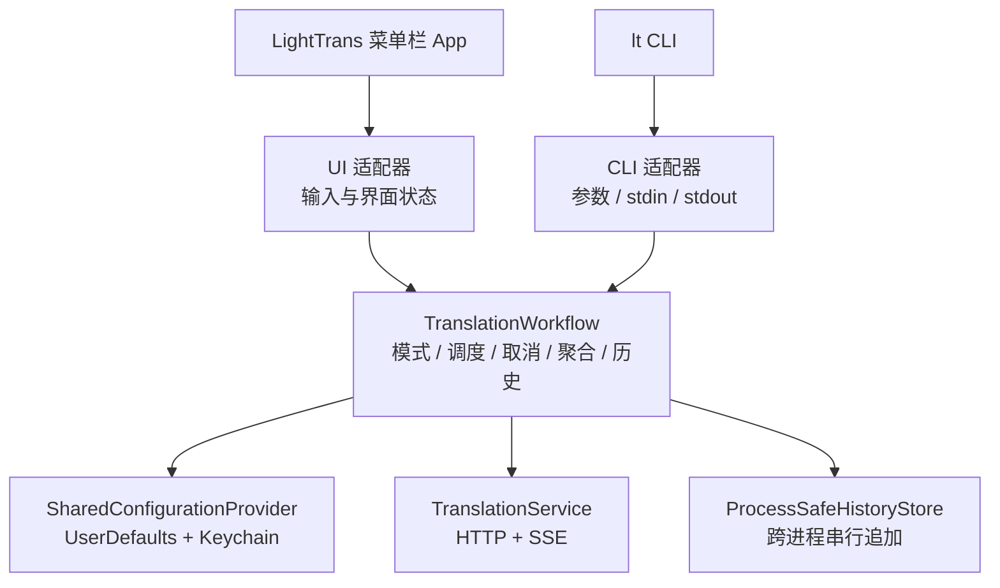

# LightTrans 命令行调用可行性分析

项目名：LightTrans（应用显示名：轻译）

文档版本：v0.3（2026-08-28）

状态：可行性分析已完成，方案 A 已于 2026-08-28 确认

范围：仅分析与方案设计，不包含代码、配置、安装脚本或发布产物修改

## 1. 结论

LightTrans 增加命令行调用方式在技术上可行，没有发现 macOS、Swift Package Manager（SPM）或现有模型接口上的阻断条件。

产品边界确定为：除交互界面与结果呈现方式不同外，CLI 与 UI 调用必须执行同一套业务行为，不允许为了降低实现成本删减功能。

因此，CLI 对每个已请求路由必须与 UI 保持以下一致：

- 使用相同的接口地址、模型、API Key、最大输出 Token 和两套提示词。
- 默认同时发起直译与转写；显式指定单路时只发起对应请求。
- 每个已请求路由保留独立的流式状态与结果。
- 使用相同的取消、部分失败、错误分类和聚合状态规则。
- 遵循同一个历史记录开关。
- 在完成、失败和停止后写入与 UI 相同格式的历史记录。
- 使用相同的设备标识、iCloud 云盘目录、本机退化目录和多设备合并规则。
- 遵守相同的隐私、日志和费用边界。

推荐采用「独立 CLI 可执行文件 + 共享完整翻译工作流」：新增 `lt` 命令，将路由选择、配置快照、请求调度、网络请求、SSE 解析、状态聚合、取消和历史写入统一放入共享模块。菜单栏 App 与 CLI 只负责各自的输入和结果呈现，不分别实现业务流程。

v0.1 中「CLI 首版不写历史记录」的建议不符合完整一致性要求，本版已撤销。历史并发风险改为通过跨进程串行追加解决，不能通过关闭 CLI 历史功能规避。

该方案属于中等范围的结构调整，不是增加一个 `main.swift` 即可完成的小改动。实施前需要先更新需求、系统设计、详细设计和实施计划，并按新增任务独立验收。

## 2. 一致性范围

### 2.1 必须完全一致的业务行为

| 行为 | UI 当前规则 | CLI 要求 |
| --- | --- | --- |
| 配置来源 | UserDefaults + 钥匙串 | 读取同一持久化域和同一钥匙串条目 |
| 提示词 | 直译模板 + 转写模板 | 使用相同模板和 `{{text}}` 替换规则 |
| 路由选择 | 固定为直译 + 转写 | 支持直译、转写、直译 + 转写，默认直译 + 转写 |
| 请求数量 | 两路并行请求 | 按所选模式执行 1 路或 2 路；双路时并行 |
| 网络协议 | Chat Completions + SSE | 调用同一网络实现 |
| 最大输出 | 两路共用 `maxTokens` | 全部已请求路由使用相同 `maxTokens` |
| 流式处理 | 两路分别接收增量片段 | 各已请求路由接收相同增量事件 |
| 部分失败 | 保留成功路由结果，失败路由显示错误 | 保留成功路由结果，失败路由返回相同错误类别 |
| 聚合状态 | 任一路失败为 `failed`，否则任一路停止为 `stopped`，否则为 `done` | 只聚合已请求路由，并使用同一函数 |
| 取消 | 同时停止两路底层请求 | `Ctrl+C` 停止全部已请求路由 |
| 历史开关 | 结束时按 `historyEnabled` 决定是否写入 | 使用同一判断时机和规则 |
| 历史内容 | 原文、模型、已请求路由结果、状态、错误、设备和时间 | 使用同一字段，并记录 CLI 选择的模式 |
| 历史目录 | iCloud 云盘可用时同步，否则本机目录 | 使用相同判定与目录 |
| 写入失败 | 只记日志，不改变翻译主结果 | 保持相同行为 |
| 隐私与日志 | 日志不包含原文、结果或 API Key | 保持相同行为 |

### 2.2 允许不同的交互与呈现

以下差异属于界面适配，不属于功能缺失：

- UI 从输入框或 macOS Services 接收文本；CLI 从位置参数或标准输入接收文本。
- UI 在两张卡片中展示流式结果；CLI 使用 JSON、NDJSON 或终端文本呈现。
- UI 通过「停止」按钮取消；CLI 通过 `Ctrl+C` 取消。
- UI 通过复制按钮写入剪贴板；CLI 把结果写入标准输出，可由调用方接入 `pbcopy` 或其他程序。
- UI 提供设置与历史窗口；CLI 读取同一设置并写入同一历史存储，但不重复提供设置窗口。
- macOS Services 的 `5,000` 字符限制只约束「外部选区自动执行」。CLI 命令本身已经是明确执行动作，不套用该自动执行限制。
- UI 固定执行直译与转写；CLI 可以显式选择单路，未指定时仍执行直译与转写。

### 2.3 不在本次范围内

- Windows、Linux 或 Intel Mac 支持。
- 后台守护进程、URL Scheme、XPC 服务或本地 HTTP 服务。
- 在命令行中保存、删除或显示 API Key。
- 使用 `--api-key` 参数或环境变量传入 API Key。
- 从命令行修改 App 的持久化配置。
- 原位替换、自动粘贴或模拟键盘输入。
- 新增第三方参数解析依赖。

## 3. 当前实现核查

### 3.1 已具备的复用基础

| 现状 | 证据 | 对 CLI 的意义 |
| --- | --- | --- |
| 模型请求集中在 `TranslationService` | `Sources/LightTrans/Services/TranslationService.swift:15-153` | 提示词渲染、HTTP 请求、SSE 解析、取消和错误分类可以直接复用 |
| 请求配置已经支持闭包注入 | `TranslationService.swift:19-48` | App 与 CLI 可以使用不同入口读取同一配置域 |
| 翻译入口返回 `AsyncThrowingStream` | `TranslationService.swift:50-78` | 两种前端可以订阅相同流式片段 |
| 双路调度已有实现 | `Sources/LightTrans/UI/PanelViewModel.swift:83-175` | 当前双路、取消和部分失败语义已有事实依据 |
| 历史聚合规则已有实现 | `PanelViewModel.swift:191-239` | CLI 不应重新实现一份聚合逻辑 |
| 历史数据结构已经支持双路结果 | `Sources/LightTrans/Storage/HistoryStore.swift:4-18` | CLI 可以生成同一 `HistoryRecord` |
| 两路历史字段均为可选 | `HistoryStore.swift:14-17` | 单路模式可以把未请求路由保持为 `nil`，不需要伪造空结果 |
| API Key 使用固定钥匙串坐标 | `Sources/LightTrans/Config/ConfigStore.swift:19-21` | CLI 可以读取同一条钥匙串记录 |
| Release 构建已有集中脚本 | `Scripts/build-app.sh:67-102` | 可以在现有构建、签名和发布校验中增加 CLI |

### 3.2 当前必须调整的部分

| 限制 | 当前状态 | 所需调整 |
| --- | --- | --- |
| SPM 目标结构 | `Package.swift:14-25` 只有一个可执行目标 | 增加共享核心目标和 CLI 目标 |
| 业务调度位置 | 双路、状态聚合和历史构造位于 `PanelViewModel` | 提取为不依赖 AppKit 或 SwiftUI 的共享工作流 |
| `TranslationService` 默认配置 | 默认初始化直接依赖 `ConfigStore` | 改为只接收不可变配置或配置提供器 |
| App 配置域 | `ConfigStore` 使用 `UserDefaults.standard` | CLI 显式读取 `UserDefaults(suiteName: "com.andy.lighttrans")` |
| 历史写入 | `HistoryStore.append` 使用 `seekToEnd` 后写入 | 增加跨进程锁和原子追加，支持 App 与多个 CLI 进程并发 |
| 历史文件版本 | 旧版 App 不参与新增锁协议 | 新版使用版本化写入文件，旧文件只读兼容 |
| 错误文案 | 面板文案位于 `PanelViewModel` | 共享错误类别；UI 和 CLI 分别呈现 |
| 发布产物 | 当前只打包 App 主可执行文件 | 嵌入、签名并安装 CLI |

### 3.3 本机只读验证

2026 年 8 月 28 日在当前开发机完成以下验证，未读取或显示配置值与 API Key 内容：

| 验证项 | 方法 | 结果 |
| --- | --- | --- |
| 运行环境 | `swift --version`、`sw_vers`、`uname -m` | Swift 6.2.3、macOS 15.7.4、`arm64` |
| 命名配置域 | 独立 Swift 进程打开 `UserDefaults(suiteName: "com.andy.lighttrans")` | 成功；7 个预期键中有 4 个已实际持久化，其余键可能仍使用注册默认值 |
| 钥匙串定位 | 独立 Swift 进程按 `LightTrans` / `apiKey` 查询条目，只检查状态码 | 成功；`SecItemCopyMatching` 返回 `errSecSuccess`，未请求密钥内容 |
| 跨进程锁能力 | 临时 Swift 进程调用 Darwin `flock` 取得并释放独占锁 | 成功；当前系统提供所需 API |
| `lt` 命令名 | 当前登录 Shell 执行 `whence -a lt` | 未发现同名命令；安装器仍必须检查并拒绝覆盖其他环境中的已有命令 |

这些结果证明当前机器具备方案所需的基础能力。它们不能替代 Release 验收：钥匙串访问提示、多个 Release 进程并发追加、iCloud 云盘目录和异常退出后的锁释放仍需实施后验证。

## 4. 硬约束

### 4.1 沿用现有约束

- 最低部署目标保持 macOS 14，当前预览版只发布 `arm64`。
- API Key 只能从钥匙串读取，不得进入 UserDefaults、命令参数、日志或源码。
- 提示词模板继续使用固定占位符 `{{text}}` 和现有字符串替换规则。
- 模型接口继续使用现有 Chat Completions、Bearer Token 和 SSE 协议。
- 历史仍采用每台设备独立 JSON Lines 文件、多设备读取时合并去重的结构。
- 不引入详细设计以外的第三方依赖。

### 4.2 新增一致性约束

- UI 与 CLI 必须调用同一个翻译工作流，禁止分别维护路由调度和历史聚合代码。
- 共享工作流接收 `literal`、`rewrite`、`both` 三种模式；UI 固定传入 `both`，CLI 默认 `both`。
- 同一次调用的全部已请求路由使用同一份配置快照。
- 历史开关的读取时机必须统一，不允许 UI 和 CLI 在设置变化时产生不同结果。
- 每次调用最多写入一条历史记录。
- `Ctrl+C` 必须先取消全部已请求路由并完成 `stopped` 历史写入，再结束 CLI 进程。
- App 与任意数量的 CLI 进程不得并发执行未加锁的 `seekToEnd + write`。
- 标准输出只承载结果数据；诊断写入标准错误。
- 输入和输出使用 UTF-8，不得静默删改首尾空格、换行、Emoji 或组合字符。
- CLI 与 UI 都不得把原文、结果或 API Key 写入系统日志。

## 5. 方案比较

### 5.1 方案 A：共享完整翻译工作流

App 与 CLI 都调用 `TranslationWorkflow`。工作流接收路由模式，并负责配置、请求调度、状态、取消、聚合和历史；两种入口只负责输入与呈现。

优点：

- 业务语义只有一份实现，满足完整一致性要求。
- App 是否运行不影响 CLI。
- 可以直接比较 UI 适配器与 CLI 适配器收到的事件和最终结果。
- 路由选择、历史记录、取消和部分失败不会因入口不同而分叉。

代价：

- 需要把部分逻辑从 `PanelViewModel` 和 `HistoryStore` 重构到共享模块。
- 需要增加跨进程历史写入机制。
- 需要扩展现有测试、构建和发布流程。

结论：推荐。

### 5.2 方案 B：只共享网络请求

App 与 CLI 共用 `TranslationService`，但各自实现路由调度、状态聚合和历史写入。

优点：初始改动较少。

代价：

- 两套调度代码可能在取消、部分失败或历史状态上出现差异。
- 每次业务规则调整都要修改和验证两处。
- 无法从结构上保证「除界面外完全一致」。

结论：不采用。v0.1 的推荐方案在共享层次上不足。

### 5.3 方案 C：CLI 通过进程间通信请求菜单栏 App

CLI 只发送请求，菜单栏 App 执行完整流程并返回结果。

优点：天然只有一套运行中业务流程和一个历史写入进程。

代价：

- App 未运行时需要启动、等待就绪并建立请求关联。
- 需要新增 XPC、Unix Domain Socket 或其他进程间协议。
- 需要处理多请求并发、超时、App 退出、版本不一致和流式回传。
- 当前 macOS Services 无返回值，不能直接承担 CLI 响应通道。

结论：首版不采用。共享工作流可以用更低的生命周期成本达到一致性。

### 5.4 方案 D：Shell 或 `curl` 包装

该方案会重复网络、双路、错误和历史逻辑，并增加密钥暴露风险。

结论：不采用。

## 6. 推荐架构



### 6.1 SPM 目标

```text
Sources/
├── LightTrans/                    # AppKit、SwiftUI、窗口和 UI 适配器
├── LightTransCore/                # 完整翻译工作流、网络、配置与历史
└── LightTransCLI/                 # 命令解析、输入输出和信号处理
```

`Package.swift` 建议形成：

- `LightTransCore`：库目标，不依赖 KeyboardShortcuts、AppKit 或 SwiftUI。
- `LightTrans`：现有 App 可执行目标，依赖 `LightTransCore` 与 KeyboardShortcuts。
- `LightTransCLI`：新增 CLI 可执行目标，依赖 `LightTransCore`。
- `LightTransCoreTests`：覆盖工作流、网络、配置、历史和并发。
- `LightTransCLITests`：覆盖参数、输入输出、格式和退出码。
- `LightTransTests`：保留 App、窗口、Services 和 UI 适配器测试。

跨目标但不需要成为外部 SDK 的声明优先使用 Swift 的 `package` 访问级别。

SPM 的新增可执行产品命名为 `lt`，对应目标仍命名为 `LightTransCLI`，避免产品命令名与 Swift 目标命名互相制约。

### 6.2 共享模块职责

建议移入 `LightTransCore`：

- `TranslationMode`：`literal`、`rewrite`、`both` 三种路由模式。
- `TranslationWorkflow`：一次翻译的唯一业务入口，接收原文和模式。
- `TranslationEvent`：两种前端共同消费的流式事件。
- `TranslationSummary`：最终双路结果和聚合状态。
- `TranslationError`：通用错误类别。
- `TranslationService`：提示词渲染、HTTP、SSE 和底层取消。
- 配置键、默认值、配置快照和钥匙串坐标。
- `KeychainHelper` 的只读能力。
- `HistoryRecord`、历史聚合函数和跨进程安全的 `HistoryStore`。

建议继续留在 App：

- `ConfigStore` 的 `ObservableObject` 与 `@Published` 属性。
- `PanelViewModel` 的界面状态映射。
- `TranslationError.panelMessage`。
- AppKit、SwiftUI、快捷键、窗口、剪贴板和 macOS Services。

建议留在 CLI：

- 参数与标准输入解析。
- JSON、NDJSON 和终端文本呈现。
- `SIGINT` 监听与进程退出码。
- 标准输出和标准错误隔离。

### 6.3 共享工作流

`TranslationWorkflow` 应统一完成以下顺序：

1. 校验输入非空。
2. 校验模式并生成已请求路由集合。
3. 读取一份请求配置快照。
4. 启动全部已请求路由；`both` 模式并行启动直译与转写。
5. 发出带路由标识的流式片段事件。
6. 分别记录已请求路由的 `done`、`failed` 或 `stopped` 状态。
7. 只对已请求路由使用唯一聚合函数计算总状态。
8. 按统一时机读取历史开关。
9. 构造一条带模式的 `HistoryRecord` 并调用共享 `HistoryStore`。
10. 历史写入完成或失败处理结束后，返回最终摘要。

建议的事件类型：

```swift
enum TranslationMode: String, Sendable {
    case literal
    case rewrite
    case both
}

enum TranslationEvent: Sendable {
    case started
    case chunk(route: TranslationRoute, text: String)
    case routeFinished(route: TranslationRoute, state: TranslationRouteState)
    case finished(TranslationSummary)
}
```

UI 固定用 `.both` 事件更新两张结果卡；CLI 根据指定模式生成对应的 NDJSON 或最终结果。事件呈现不同，已请求路由的业务状态相同。

### 6.4 配置读取

共享配置提供器负责：

1. 使用 App 的 `UserDefaults.standard`，或 CLI 的 `UserDefaults(suiteName: "com.andy.lighttrans")` 打开同一持久化域。
2. 注册同一套默认接口地址、提示词和 `maxTokens`。
3. 读取接口地址、模型名、两套模板和最大输出 Token。
4. 用固定坐标 `LightTrans` / `apiKey` 从钥匙串读取 API Key。
5. 形成不可变请求配置快照。

模型名或 API Key 缺失时，两种入口都进入相同的 `notConfigured` 分支，并按历史开关写入同语义的失败记录。

## 7. CLI 命令契约

### 7.1 命令格式

```bash
lt [--mode literal|rewrite|both] [--format text|json|ndjson] [--] [TEXT...]
```

默认值：

- `--mode both`：同时执行直译与转写。
- `--format text`：按「直译」「转写」区块输出终端文本。

三种模式：

```bash
# 默认：直译 + 转写
lt AI 用于辅助分析和编码，技术决策、验证和生产结果由我负责

# 仅直译
lt --mode literal AI 用于辅助分析和编码

# 仅转写
lt --mode rewrite AI 用于辅助分析和编码

# 显式指定直译 + 转写
lt --mode both AI 用于辅助分析和编码
```

`--mode` 与 `--format` 各只能出现一次；值无效或重复时按用法错误处理。以连字符开头的正文通过 `--` 与选项分隔。

### 7.2 输入规则

- 存在一个或多个位置参数时，用单个空格连接为原文。因此未加引号的示例可以直接调用。
- 没有位置参数且标准输入不是终端时，读取标准输入直至 EOF。
- 同时存在位置参数和管道输入时拒绝执行。
- 没有位置参数且标准输入是终端时显示用法并退出。
- 只使用裁剪后的副本判断是否为空；传入工作流的原文不得改变。
- 需要保留连续空格、Shell 特殊字符或多行格式时，使用引号或标准输入，不能依赖参数连接。
- CLI 明确执行不套用 macOS Services 的 `5,000` 字符自动执行限制。

### 7.3 默认文本格式

`text` 格式在全部已请求路由与历史处理结束后输出。`both` 模式严格使用以下区块标记：

```text
-直译-
AI is used to assist with analysis and coding, while I remain responsible for technical decisions, verification, and production outcomes.
-转写-

# Collaboration Model: AI-Assisted Analysis and Coding

You are an AI assistant supporting me with technical analysis and coding tasks. You operate in an advisory and assistive capacity only.

## Division of Responsibilities

**You are responsible for:**

- Assisting with technical analysis, problem breakdown, and research
- Writing, reviewing, and refactoring code upon request
- Exploring implementation options and explaining trade-offs, risks, and alternatives
- Asking clarifying questions whenever requirements or context are ambiguous

**I retain sole responsibility for:**

- All final technical decisions (architecture, design, tooling, dependencies)
- Verifying, testing, and validating every output you produce
- Approving and releasing anything into production

## Required Behavior

1. Treat all your outputs as proposals or drafts — never as final decisions.
2. When multiple viable approaches exist, present them with pros and cons and let me choose. Do not commit to a single approach unilaterally unless I explicitly instruct you to.
3. Explicitly flag assumptions, uncertainties, edge cases, and potential risks.
4. Never describe your output as "production-ready" or claim it has been validated; always note that verification is pending my review.
5. For any irreversible or high-impact action (e.g., deployment, data modification, publishing), stop and wait for my explicit confirmation before proceeding.
```

仅直译时只输出：

```text
-直译-
{直译结果}
```

仅转写时只输出：

```text
-转写-
{转写结果}
```

区块标记固定为 `-直译-` 和 `-转写-`，不得受模型输出或系统语言影响。模型结果本身不裁剪、不改写；CLI 只在区块边界补充必要换行。失败路由的诊断写入标准错误，不把错误文案混入成功结果。

### 7.4 JSON 最终结果

`json` 格式在全部已请求路由与历史处理结束后写出一条最终结果：

```json
{
  "mode": "both",
  "status": "done",
  "model": "example-model",
  "literal": {"status": "done", "text": "..."},
  "rewrite": {"status": "done", "text": "..."}
}
```

部分失败时保留成功路由：

```json
{
  "mode": "both",
  "status": "failed",
  "model": "example-model",
  "literal": {"status": "done", "text": "..."},
  "rewrite": {"status": "failed", "text": "", "error": "network"}
}
```

单路模式只包含已请求路由；未请求路由不输出 `null` 占位。JSON 不包含 API Key、完整服务端错误响应或历史文件路径。

### 7.5 NDJSON 流式事件

`ndjson` 格式逐行输出可独立解析的事件，以保留 UI 已具备的流式能力：

```json
{"event":"started","mode":"both"}
{"event":"chunk","route":"literal","text":"..."}
{"event":"chunk","route":"rewrite","text":"..."}
{"event":"route_finished","route":"literal","status":"done"}
{"event":"finished","mode":"both","status":"done"}
```

每行必须是完整 JSON；`both` 模式的两个路由片段可以交错，但不能出现半行或混合 JSON。单路模式不产生另一条路由的事件。

### 7.6 标准错误与退出码

| 退出码 | 含义 |
| --- | --- |
| `0` | 全部已请求路由成功，历史处理已结束 |
| `1` | 至少一个已请求路由失败；`both` 模式可能部分成功 |
| `2` | 用法错误、输入冲突或空输入 |
| `3` | 配置域或钥匙串不可访问 |
| `70` | CLI 内部错误 |
| `130` | 收到 `SIGINT`，全部已请求路由已停止且历史处理已结束 |

标准错误只写入简短诊断，不写原文、模型结果或 API Key。

### 7.7 取消

`Ctrl+C` 等价于 UI 的「停止」：

1. 取消共享工作流。
2. 停止全部已请求路由的底层网络请求。
3. 保留已经收到的各路由部分结果。
4. 聚合状态设为 `stopped`。
5. 历史开关开启时写入一条 `stopped` 记录。
6. 等待工作流完成历史处理。
7. 以退出码 `130` 结束。

CLI 不得在收到信号后立即 `exit`，否则会跳过历史写入。

## 8. 跨进程历史写入设计

### 8.1 一致性要求

CLI 历史行为必须与 UI 相同：

- `historyEnabled = true` 时，`done`、`failed`、`stopped` 均写一条记录。
- `historyEnabled = false` 时，两种入口都不写记录。
- 一次调用最多一条记录。
- 历史状态只聚合已请求路由；未请求路由不参与成功、失败或停止判断。
- `both` 模式部分失败时记录为 `failed`，保留成功路由和已收到的失败路由部分结果。
- `literal` 模式只写 `literalOutput`，`rewriteOutput` 保持 `nil`。
- `rewrite` 模式只写 `rewriteOutput`，`literalOutput` 保持 `nil`。
- `Ctrl+C` 必须记录 `stopped`，不能因进程退出丢失。
- 历史写入失败只记不含敏感内容的错误日志，不改变翻译结果。

建议为 `HistoryRecord` 增加可选字段 `mode`，值为 `literal`、`rewrite` 或 `both`。新版 UI 和 CLI 都显式写入该字段；旧记录缺少 `mode` 时，根据 `output`、`literalOutput` 和 `rewriteOutput` 推断显示方式。

JSON 解码保持向后兼容：新版可以读取缺少 `mode` 的旧记录，旧版也会忽略不认识的 `mode` 字段。但旧版历史窗口不理解单路模式，可能仍显示一个未请求路由的空卡片；因此当前版本必须同步更新 `HistoryWindowView`，不能把「可解码」视为「显示行为完全兼容」。

历史详情只展示本次请求涉及的结果卡片：单路记录不显示未请求路由的空卡片，双路记录维持现有直译与转写布局。

### 8.2 当前风险

当前 `HistoryStore.append` 的顺序是：

```text
打开文件 → seekToEnd → write
```

该顺序只能证明单进程顺序调用时可用。App 与多个 CLI 进程同时追加同一文件时，不能保证每条 JSON Lines 完整。

### 8.3 推荐写入协议

新版 App 与 CLI 使用同一个 `ProcessSafeHistoryStore`：

1. 根据设备 ID 计算本机写入文件和本机锁文件。
2. 在 `~/Library/Application Support/LightTrans/locks/` 创建不参与 iCloud 同步的锁文件。
3. 使用 Darwin `flock(LOCK_EX)` 取得设备级独占锁。
4. 把 `HistoryRecord` 编码为一条完整 UTF-8 JSON Lines 数据。
5. 用 `O_APPEND | O_CREAT | O_WRONLY` 打开历史文件。
6. 在持锁期间完成整条数据写入；短写时继续写完，禁止只调用一次后假定完整。
7. 关闭历史文件并释放锁。
8. 任一步失败时不得退化为无锁写入。

读取本机当前写入文件时使用同一锁文件的共享锁，避免读到正在追加的半行。其他设备文件仍按现有只读方式加载。

锁文件只协调同一台 Mac 上的 App 和 CLI。其他设备继续写各自的历史文件，因此不需要跨设备分布式锁。

### 8.4 版本化历史文件

旧版 App 不会参与新增锁协议。为避免旧版进程与新版 CLI 同时写同一文件，建议新版写入：

```text
history-v2-{deviceID 前 8 位}.jsonl
```

原 `history-{deviceID 前 8 位}.jsonl` 保留为只读历史文件，不迁移、不改写、不删除。历史窗口继续读取所有 `history-*.jsonl` 并按记录 ID 去重。

这样即使另一份旧版 App 仍在运行，旧版和新版也不会写同一文件。新 App 与所有 CLI 进程通过本机锁串行写入 v2 文件。

该变化需要补充系统设计 L-8：保留「每台设备只写自己的文件、不同设备不写同一文件」，并增加「同一设备上的多个进程必须持锁串行追加；旧版本文件只读」。

### 8.5 待验证假设

- Release App 与 Release CLI 都能取得同一锁文件的 `flock`。
- 多个 CLI 进程并发时不会丢行、交错或产生坏 JSON。
- 进程被 `SIGKILL` 终止后，系统释放文件锁，后续写入可继续。
- iCloud 云盘目录中的 v2 JSON Lines 文件可以在本机锁保护下稳定追加。
- 旧文件与 v2 文件合并读取不会产生重复或排序变化。

这些假设必须在实施任务开始阶段先验证，不成立时停止编码并重新评估 App 代理写入方案。

## 9. 构建、安装与发布

### 9.1 应用包内位置

建议把 Release CLI 放入：

```text
/Applications/LightTrans.app/Contents/Helpers/lt
```

该位置随 App 一起更新，避免 App 与 CLI 版本分离。构建脚本在签名前复制 CLI，并在签名后分别验证 App 与 CLI。

### 9.2 命令安装

建议新增独立安装脚本，默认在 `~/.local/bin/lt` 创建指向应用包内 CLI 的符号链接：

- 不覆盖现有同名文件或非目标符号链接。
- 目标 App 不存在时停止并提示先安装 App。
- `~/.local/bin` 不在 `PATH` 时只显示所需配置，不自动修改 Shell 配置文件。
- 如需安装到 `/usr/local/bin`，由显式参数选择。
- 卸载只删除由该脚本创建且仍指向 LightTrans 的符号链接。

不复制独立 CLI 二进制，避免 App 更新后命令仍运行旧版本。

### 9.3 发布校验

现有发布流程需要增加：

- CLI 文件存在且具有可执行权限。
- CLI 只包含 `arm64` 架构。
- CLI 位于预期目录。
- App 与嵌入 CLI 通过严格签名校验。
- ZIP 往返解压后，CLI 路径、权限、架构和签名状态不变。
- `lt --version` 与 `CFBundleShortVersionString` 一致。
- CLI 不依赖开发机 `.build`、源码目录或额外动态库。
- App 和 CLI 使用同一 Core 版本，不允许分别发布。

## 10. 预计改动范围

| 范围 | 预期改动 |
| --- | --- |
| `Package.swift` | 增加 Core 与 CLI 目标，调整测试依赖 |
| `TranslationService.swift` | 移入 Core，改为接收共享配置快照 |
| 新 `TranslationWorkflow` | 统一模式、路由调度、取消、聚合和历史写入 |
| `ConfigStore.swift` | 复用 Core 配置定义，不改变现有键和值 |
| `KeychainHelper.swift` | 提供 Core 可复用的只读入口 |
| `HistoryStore.swift` | 移入或拆分到 Core，增加锁、v2 文件和兼容读取 |
| `HistoryWindowView.swift` | 按 `mode` 只展示已请求路由，兼容缺少 `mode` 的旧记录 |
| `PanelViewModel.swift` | 改为消费共享工作流事件，只保留界面状态 |
| `Sources/LightTransCLI/` | 新增参数、输入输出、格式和信号处理 |
| `Tests/` | 增加 Core、CLI、跨进程历史和一致性测试 |
| `Scripts/build-app.sh` | 构建、嵌入并校验 CLI |
| `Scripts/package-release.sh` | 增加 CLI 的 ZIP 往返、架构、版本和签名校验 |
| 新 CLI 安装脚本 | 创建与安全移除符号链接 |
| `docs/01` 至 `docs/04` | 增加需求、决策、详细设计和新的实施任务 |
| `README.md`、`CHANGELOG.md` | 实施验收通过后补充使用与发布说明 |

## 11. 验证与验收

### 11.1 UI 与 CLI 一致性测试

使用可注入的时间、设备 ID、配置和网络响应，对 UI 的 `both` 模式与 CLI 的 `both` 模式执行同一组完整用例：

- 双路均成功。
- 直译成功、转写失败。
- 直译失败、转写成功。
- 双路均失败。
- 翻译中停止。
- 配置缺失。
- 历史开关开启与关闭。
- 历史写入失败。
- SSE 坏行、无有效内容和 `[DONE]`。

除界面字段和输出格式外，两种入口必须得到相同的路由状态、文本、聚合状态、错误类别和历史记录。测试不得只比较「是否成功」。

CLI 的 `literal` 与 `rewrite` 模式另行覆盖：只启动指定路由，聚合状态只考虑该路由，历史中未请求路由为 `nil`，历史详情不显示未请求路由。

### 11.2 CLI 合同测试

- 三种模式、默认 `both`、无效模式和重复 `--mode`。
- 单个或多个位置参数、标准输入、输入冲突、`--` 分隔和空输入。
- 首尾空格、换行、Emoji、组合字符和中英文混排。
- 默认文本格式及固定的 `-直译-`、`-转写-` 区块标记。
- JSON、NDJSON 和文本格式在三种模式下只包含已请求路由。
- `literal`、`rewrite`、`both` 分别写入正确的 `mode` 和可选结果字段。
- 标准输出不含诊断，标准错误不含原文、结果或 API Key。
- `SIGINT` 停止全部已请求路由、写入 `stopped` 历史并返回 `130`。
- 部分失败保留成功结果并返回非零退出码。

### 11.3 跨进程历史测试

- App 与 1 个 CLI 同时追加。
- App 与多个 CLI 同时追加。
- 50 个 CLI 进程同时各写一条记录，最终必须存在 50 条完整、唯一、可解码的新增记录。
- 在持锁进程正常退出、`SIGINT` 和 `SIGKILL` 后继续追加。
- 锁获取失败时不得执行无锁写入。
- 本机目录与 iCloud 云盘目录分别验证。
- 旧文件和 v2 文件合并读取，记录数量、去重和排序正确。

### 11.4 回归与发布验收

- 运行全部现有单元测试。
- 完成 Debug/Release 构建、App 打包和严格签名。
- 重新执行现有 UI 视觉与真机交互回归。
- 在 App 运行和未运行状态分别调用 CLI。
- 用已安装 App 保存配置后，Release CLI 读取同一配置与钥匙串。
- 执行受控的真实请求：`literal`、`rewrite`、`both` 各一次；其中 `both` 验证双路并行流式事件，单路模式验证未启动另一条路由。
- 验证完成、部分失败、断网、配置缺失和停止历史。
- 从发布 ZIP 重新下载并重复 CLI 路径、架构、签名、版本和真实调用检查。

## 12. 风险与应对

| 风险 | 影响 | 应对 |
| --- | --- | --- |
| 只共享网络层 | UI 与 CLI 的业务行为逐渐分叉 | 共享完整 `TranslationWorkflow` |
| Core 重构改变 UI 行为 | 已验收功能回归 | 先固定现有行为测试，再迁移；逐步比较事件与历史 |
| App 与 CLI 并发写历史 | JSON Lines 损坏 | 本机锁 + `O_APPEND` + v2 文件 |
| 旧版 App 不参与锁协议 | 新旧进程仍可能冲突 | 旧文件只读兼容，新版写 v2 文件 |
| 旧版历史窗口不理解单路模式 | 显示未请求路由的空卡片 | 当前版本同步更新 `HistoryWindowView`；兼容结论区分解码与显示 |
| CLI 收到 `Ctrl+C` 后立即退出 | 缺少 `stopped` 历史 | 先等待共享工作流完成取消与历史处理 |
| Release CLI 钥匙串行为不同 | CLI 无法读取 API Key | 干净安装环境先验证；失败时评估 App 代理方案 |
| 配置默认值只注册、未持久化 | CLI 读取到缺失键 | Core 集中定义并注册同一默认值 |
| NDJSON 并发输出交错 | 下游无法解析 | 单一串行输出器逐行写完整事件 |
| 命令链接指向旧版本 | App 与 CLI 版本不一致 | 链接固定指向应用包内 CLI |

## 13. 实施门禁

满足以下条件后才进入编码：

1. 确认采用第 6 节的共享完整翻译工作流。
2. 确认 CLI 支持 `literal`、`rewrite`、`both`，默认 `both`。
3. 确认默认文本区块标记固定为 `-直译-` 和 `-转写-`。
4. 确认 CLI 遵循同一历史开关，并按所选模式写入对应历史字段。
5. 确认采用第 8 节的跨进程锁与版本化历史文件。
6. 把已确认结论补入 `docs/01-requirements.md`、`docs/02-system-design.md`、`docs/03-detailed-design.md` 和 `docs/04-implementation-plan.md`。
7. 先验证 Release CLI 钥匙串访问、`flock`、并发追加和 iCloud 云盘写入；任一关键假设不成立时停止并修订设计。

## 14. 最终判断

可行性结论：可行。

推荐方案：新增独立 `lt` CLI，并通过 `LightTransCore.TranslationWorkflow` 与菜单栏 App 共用完整业务流程。

一致性结论：UI 固定使用 `both`；CLI 支持 `literal`、`rewrite`、`both` 且默认 `both`。每个已请求路由的请求、取消、错误、状态聚合和历史写入都由同一工作流完成。

主要成本：需要完成受控的 SPM 目标拆分、共享工作流重构、跨进程历史写入，以及构建、安装和发布校验扩展。

主要未决风险：Release CLI 的钥匙串访问与跨进程历史锁仍需在干净安装环境验证。该风险是实施门禁，不再通过删减历史功能规避。
