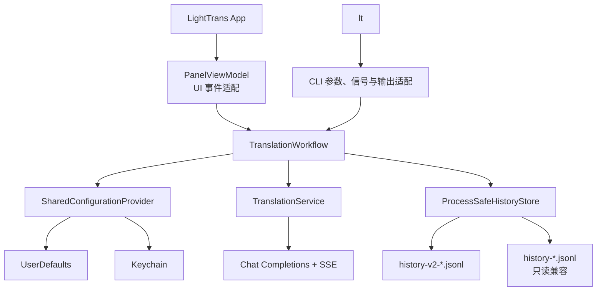
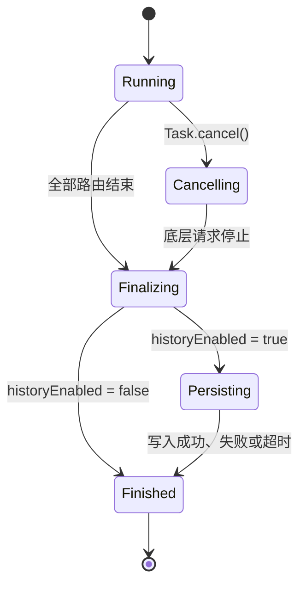

# LightTrans 命令行接口详细设计

项目名：LightTrans（应用显示名：轻译）

文档版本：v1.0（2026-08-28）

状态：详细设计已于 2026-08-28 确认，T21 已实施并待用户验收

关联文档：`01-requirements.md`、`02-system-design.md`、`03-detailed-design.md`、`04-implementation-plan.md`、`09-command-line-interface-feasibility.md`

本文档是 CLI 与共享核心重构的编码依据。实施前先把需求、系统设计和实施任务同步到 `docs/01` 至 `docs/04`；实施结果与未完成的真机验收项继续回写实施计划。

## 1. 目标与范围

### 1.1 目标

新增独立命令 `lt`，并满足以下要求：

- UI 与 CLI 共用完整翻译工作流，不分别维护路由调度、取消、状态聚合或历史写入逻辑。
- CLI 支持 `literal`、`rewrite`、`both` 三种模式，默认使用 `both`。
- 每个已请求路由使用与 UI 相同的配置、提示词渲染、网络协议、流式解析和错误分类。
- 完成、失败和停止都遵循同一个历史开关，并写入同一历史存储。
- App、CLI 和多个 CLI 进程可以安全并发追加本机历史文件。
- CLI 随 App 一起构建、签名和发布，不形成版本分离的独立产物。

### 1.2 允许不同的部分

以下差异属于入口和呈现差异：

- UI 从输入框或 macOS 服务接收文字；CLI 从位置参数或标准输入接收文字。
- UI 把流式片段映射到两张结果卡片；CLI 使用文本、JSON 或 NDJSON 呈现。
- UI 通过「停止」按钮取消；CLI 通过 `Ctrl+C` 取消。
- UI 提供复制、设置和历史窗口；CLI 通过标准输出交付结果，只读取现有设置并写入历史。
- UI 固定请求 `both`；CLI 可以显式选择单路。

### 1.3 不在本次范围内

- Windows、Linux、Intel Mac 或 Universal Binary。
- XPC、后台守护进程、本地 HTTP 服务或 URL Scheme。
- 通过 CLI 保存、删除、显示或覆盖 API Key。
- 通过命令参数或环境变量传入 API Key。
- 通过 CLI 修改 App 设置。
- 原位替换、自动粘贴、模拟键盘输入或新增系统权限。
- 为 CLI 新增第三方参数解析依赖。
- 修改 macOS 服务的 `5,000` 字符自动执行限制。

## 2. 现状基线

本设计基于提交 `f8fc5eb` 和当前工作区代码。`docs/09-command-line-interface-feasibility.md` 是上一阶段形成的可行性文档，本设计保留并细化其中已确认的方案 A。

| 事实 | 当前证据 | 设计影响 |
| --- | --- | --- |
| SPM 只有 App 可执行目标和一个测试目标 | `Package.swift:16-25` | 需要增加 Core、CLI 和对应测试目标 |
| 配置键、默认值和钥匙串坐标集中在 `ConfigStore` | `ConfigStore.swift:9-92` | 机器可共享的定义应移入 Core，`ObservableObject` 留在 App |
| `TranslationService` 默认直接读取 `ConfigStore` | `TranslationService.swift:19-48` | 网络层改为只接收不可变请求配置 |
| 双路并行、取消、聚合和历史构造在 `PanelViewModel` | `PanelViewModel.swift:84-247` | 完整业务工作流必须移入 Core |
| 历史追加使用 `seekToEnd + write` | `HistoryStore.swift:67-83` | 必须增加进程锁、追加标志和短写处理 |
| 历史详情用任一路字段是否非空判断双路记录 | `HistoryWindowView.swift:222-242` | 增加 `mode` 后按有效模式显示卡片 |
| 打包脚本只复制 App 主可执行文件 | `Scripts/build-app.sh:68-99` | 增加 CLI 的复制、权限、签名和校验 |
| 发布脚本只校验 App 主可执行文件架构 | `Scripts/package-release.sh:58-82` | ZIP 前后都必须校验嵌入 CLI |

### 2.1 必须保留的现有行为

- 请求开始时保留输入原文，不裁剪首尾空格或换行。
- 两路都被请求时并行执行，片段可以交错到达。
- 单路失败不删除另一条路由的成功结果。
- 手动停止优先于已发生的单路失败，聚合历史状态记为 `stopped`。
- 历史开关在任务结束时读取；运行中关闭开关会阻止该次历史写入。
- 历史写入失败不改变翻译主结果，只记录不含敏感内容的诊断。
- 外部选区的新请求先停止旧任务并等待旧任务写完历史，再开始最新请求。
- 空输入不发请求、不写历史。

## 3. 硬约束

除系统设计 L-1 至 L-14 外，增加以下约束：

| 编号 | 约束 |
| --- | --- |
| CLI-L1 | UI 与 CLI 必须调用同一个 `TranslationWorkflow`，禁止复制路由调度或历史聚合实现。 |
| CLI-L2 | 同一次调用的接口地址、模型、API Key、最大输出 Token 和两套模板必须来自同一配置快照。 |
| CLI-L3 | 历史开关继续在工作流结束时读取，不能并入请求开始时的配置快照。 |
| CLI-L4 | 每次工作流运行最多写入一条历史记录；未请求路由不得参与状态聚合。 |
| CLI-L5 | `Ctrl+C` 必须取消全部已请求路由，等待历史处理结束后再返回退出码 `130`。 |
| CLI-L6 | 同一台 Mac 上的 App 与任意数量 CLI 进程不得无锁写同一历史文件。 |
| CLI-L7 | 旧历史文件不迁移、不改写、不删除；新版本只追加 v2 文件。 |
| CLI-L8 | 标准输出只写结果协议；诊断只写标准错误。两者都不得包含 API Key。 |
| CLI-L9 | CLI 不修改 UserDefaults、钥匙串、Shell 配置或 PATH；设备 ID 首次生成属于现有历史协议的例外。 |
| CLI-L10 | App 与 CLI 必须从同一源码和同一次 Release 构建产生，版本检查失败时禁止打包。 |
| CLI-L11 | `deviceID` 首次生成必须跨进程串行化；多个首次启动进程必须得到同一个值。 |

## 4. 总体架构



依赖方向固定为：App/CLI → Core → Foundation、Security、Darwin。`LightTransCore` 不得依赖 AppKit、SwiftUI 或 KeyboardShortcuts。

### 4.1 模块职责

| 模块 | 负责 | 不负责 |
| --- | --- | --- |
| `LightTransCore` | 配置快照、提示词渲染、模型请求、流式事件、路由状态、取消、聚合、历史构造与读写 | 窗口、剪贴板、命令行参数、终端格式 |
| `LightTrans` | App 生命周期、设置、面板、历史窗口、macOS 服务、剪贴板及事件到 UI 状态的映射 | 独立实现网络请求、状态聚合或历史构造 |
| `LightTransCLI` | 参数、输入、信号、stdout/stderr、退出码、版本和帮助 | 保存设置、读取 UI 状态、独立实现业务流程 |

## 5. SPM 目标与文件结构

### 5.1 Package.swift

```swift
products: [
    .executable(name: "LightTrans", targets: ["LightTrans"]),
    .executable(name: "lt", targets: ["LightTransCLI"])
],
targets: [
    .target(name: "LightTransCore"),
    .executableTarget(
        name: "LightTrans",
        dependencies: [
            "LightTransCore",
            .product(name: "KeyboardShortcuts", package: "KeyboardShortcuts")
        ]
    ),
    .executableTarget(
        name: "LightTransCLI",
        dependencies: ["LightTransCore"]
    ),
    .testTarget(name: "LightTransCoreTests", dependencies: ["LightTransCore"]),
    .testTarget(name: "LightTransCLITests", dependencies: ["LightTransCLI", "LightTransCore"]),
    .testTarget(name: "LightTransTests", dependencies: ["LightTrans", "LightTransCore"])
]
```

可执行产品名为 `lt`，Swift 目标名为 `LightTransCLI`。最低部署目标继续为 macOS 14。

### 5.2 目标目录

```text
Sources/
├── LightTrans/
│   ├── Config/ConfigStore.swift
│   ├── UI/PanelViewModel.swift
│   ├── UI/HistoryWindowView.swift
│   └── ...                         # 其余 AppKit、SwiftUI 与系统集成文件
├── LightTransCore/
│   ├── Config/
│   │   ├── ConfigurationDefaults.swift
│   │   └── SharedConfigurationProvider.swift
│   ├── Domain/
│   │   ├── TranslationTypes.swift
│   │   └── TranslationError.swift
│   ├── Services/TranslationService.swift
│   ├── Storage/
│   │   ├── HistoryRecord.swift
│   │   └── ProcessSafeHistoryStore.swift
│   └── Workflow/TranslationWorkflow.swift
└── LightTransCLI/
    ├── LightTransCLI.swift
    ├── CLIOptions.swift
    ├── CLIInputReader.swift
    ├── CLIOutputWriter.swift
    └── SignalCoordinator.swift
```

现有 `TranslationService.swift`、`KeychainHelper.swift` 和 `HistoryStore.swift` 的机器无关部分迁入 Core。App 内保留的 `ConfigStore` 继续提供 `@Published` 属性，但复用 Core 中的键名、默认值和钥匙串坐标。

## 6. 核心领域类型

### 6.1 路由与模式

```swift
public enum TranslationRoute: String, Codable, Sendable {
    case literal
    case rewrite
}

public enum TranslationMode: String, Codable, Sendable {
    case literal
    case rewrite
    case both

    var routes: [TranslationRoute] {
        switch self {
        case .literal: [.literal]
        case .rewrite: [.rewrite]
        case .both: [.literal, .rewrite]
        }
    }
}
```

`routes` 的顺序固定为直译在前、转写在后。该顺序用于稳定测试、错误合并、文本输出和历史显示，不限制并发返回顺序。

### 6.2 状态与失败

```swift
public enum TranslationRouteStatus: String, Codable, Sendable {
    case done
    case stopped
    case failed
}

public enum TranslationStatus: String, Codable, Sendable {
    case done
    case stopped
    case failed
}

public enum TranslationErrorCode: String, Codable, Sendable {
    case notConfigured
    case configurationUnavailable
    case invalidKey
    case rateLimited
    case insufficientQuota
    case badURL
    case network
    case badResponse
}

public struct TranslationFailure: Codable, Sendable, Equatable {
    let code: TranslationErrorCode
    let message: String
}
```

现有错误类别全部保留。新增 `configurationUnavailable`，只用于 UserDefaults 域或钥匙串因系统错误无法访问；API Key 不存在仍是 `notConfigured`。

Core 提供稳定的简体中文用户消息，历史记录使用该消息。UI 可以直接展示；CLI 的 JSON/NDJSON 同时提供稳定错误码，文本模式把消息写入标准错误。服务端原始响应只保留现有最多 100 字摘要，不写日志。

### 6.3 请求、事件和摘要

```swift
public struct TranslationRequest: Sendable {
    let text: String
    let mode: TranslationMode
}

public enum TranslationEvent: Sendable {
    case started(mode: TranslationMode, model: String)
    case chunk(route: TranslationRoute, text: String)
    case routeFinished(TranslationRouteSummary)
    case finished(TranslationSummary)
}

public struct TranslationRouteSummary: Sendable, Equatable {
    let route: TranslationRoute
    let status: TranslationRouteStatus
    let text: String
    let failure: TranslationFailure?
}

public struct TranslationSummary: Sendable, Equatable {
    let mode: TranslationMode
    let status: TranslationStatus
    let model: String
    let literal: TranslationRouteSummary?
    let rewrite: TranslationRouteSummary?
    let history: HistoryWriteOutcome
}
```

未请求路由对应的摘要必须为 `nil`。`finished` 是最后一个事件，只能在历史处理完成后发出。

## 7. 配置设计

### 7.1 共享定义

Core 集中定义以下内容：

- UserDefaults 域：`com.andy.lighttrans`。
- 现有全部键名与默认值。
- 钥匙串服务名 `LightTrans`、账户名 `apiKey`。
- `{{text}}` 渲染规则。

App 的 `ConfigStore` 使用 `UserDefaults.standard`；CLI 使用 `UserDefaults(suiteName: "com.andy.lighttrans")`。两者都先注册 Core 中的同一组默认值。

### 7.2 请求配置快照

```swift
public struct TranslationConfigurationSnapshot: Sendable {
    let apiBaseURL: String
    let modelName: String
    let apiKey: String?
    let maxTokens: Int
    let literalTemplate: String
    let rewriteTemplate: String
}

public protocol TranslationConfigurationProviding {
    func loadRequestSnapshot() throws -> TranslationConfigurationSnapshot
    func isHistoryEnabled() -> Bool
    func deviceID() -> String
}
```

读取时机固定为：

1. 工作流开始时调用一次 `loadRequestSnapshot()`。
2. 全部已请求路由共享该快照。
3. 所有路由结束后重新调用 `isHistoryEnabled()`。
4. 历史存储在计算本机文件名时读取 `deviceID()`。首次无值时，配置提供器先获取本机 `device-id.lock`，同步并再次读取 UserDefaults；仍无值时才生成 UUID、持久化并释放锁。

模板、模型或接口在请求进行中变化，只影响下一次调用。历史开关在结束前变化，按结束时的值处理，与当前 UI 行为一致。

### 7.3 钥匙串读取

Core 的只读接口改为可区分「不存在」和「读取失败」：

```swift
static func read(service: String, account: String) throws -> String?
```

- `errSecSuccess`：返回字符串。
- `errSecItemNotFound`：返回 `nil`。
- 其他状态：抛出 `KeychainError.unexpectedStatus`，工作流映射为 `configurationUnavailable`。

App 设置窗口继续使用现有原子更新和删除逻辑。CLI 不链接任何写入 API 的命令入口。

## 8. TranslationService 重构

### 8.1 新接口

```swift
public struct ModelRequestConfiguration: Sendable {
    let apiBaseURL: String
    let modelName: String
    let apiKey: String
    let maxTokens: Int
}

public struct TranslationService: Sendable {
    func translate(
        text: String,
        template: String,
        configuration: ModelRequestConfiguration
    ) -> AsyncThrowingStream<String, Error>
}
```

网络层不再引用 `ConfigStore`，也不自行重新读取配置。`testConnection` 保留在 Core，仍接收设置窗口当前内存中的显式参数，不写历史。

### 8.2 保持不变的协议

- 请求地址：`{apiBaseURL}/chat/completions`。
- 鉴权：Bearer Token。
- 请求体：`stream: true`、模型名、`max_tokens` 和单条 user message。
- 提示词：存在 `{{text}}` 时纯字符串替换，否则使用「模板 + 两个换行 + 原文」。
- 超时：60 秒。
- SSE：只处理 `data:` 行，`[DONE]` 结束，坏行跳过。
- 没有任何有效内容时返回 `badResponse`。
- 调用任务取消后终止底层 URLSession 任务。

### 8.3 日志

网络日志只记录路由、开始、结束、HTTP 状态类别和错误码。不得记录原文、渲染后提示词、结果、API Key、Authorization Header 或完整服务端响应。

## 9. TranslationWorkflow

### 9.1 公共接口

```swift
public struct TranslationWorkflow: Sendable {
    public func run(
        request: TranslationRequest,
        emit: @escaping @Sendable (TranslationEvent) async -> Void
    ) async -> TranslationSummary
}
```

工作流把网络错误转换为路由摘要，正常返回最终摘要，不把单路业务失败作为顶层抛出。调用方通过承载 `run` 的 `Task` 取消工作流，并通过 `await task.value` 等待取消、聚合和历史处理结束。

### 9.2 运行顺序

1. 使用裁剪副本判断原文是否为空；原文为空时不启动工作流，由入口层按用法或空操作处理。
2. 尝试读取一次请求配置快照；失败时保留配置访问错误。
3. 发出 `started`。配置快照不可用时 `model` 使用空字符串。
4. 校验接口地址、模型、API Key 和最大输出 Token；校验或配置访问失败时，为全部已请求路由生成失败摘要，不发网络请求。
5. 配置有效时，按模式创建 1 个或 2 个路由任务；双路使用结构化并发同时启动。
6. 每条路由消费同一个 `TranslationService`，但传入对应模板。
7. 每收到片段，先追加到该路由结果，再发出 `chunk`。
8. 路由完成、失败或取消后，发出一次 `routeFinished`。
9. 全部已请求路由结束后计算聚合状态。
10. 在结束时读取历史开关；开启时构造并追加一条历史记录。
11. 等待历史写入返回结果。
12. 发出 `finished` 并返回相同摘要。

### 9.3 事件串行化

工作流内部使用一个事件发射 actor。两个路由可以并行产生片段，但所有 `emit` 调用必须经过该 actor 串行执行。

保证范围：

- `started` 是每次有效工作流运行的第一个事件，配置缺失或配置访问失败也不例外。
- 同一路由片段保持原始顺序。
- 任一路由的 `routeFinished` 一定在该路由最后一个 `chunk` 之后。
- `finished` 一定在全部 `routeFinished` 和历史处理之后。
- 两个路由之间的片段顺序不固定，不得在测试中假定直译总是先到达。

### 9.4 聚合规则

只聚合 `request.mode.routes`：

1. 工作流任务被调用方取消时，聚合状态强制为 `stopped`；历史 `error` 为 `nil`。
2. 未取消且任一路由为 `failed` 时，聚合状态为 `failed`。
3. 未取消且任一路由为 `stopped` 时，聚合状态为 `stopped`。
4. 其他情况为 `done`。

失败消息按 `literal`、`rewrite` 顺序使用 `；` 合并。单路模式只保留该路错误。

### 9.5 取消状态机



取消只允许从运行阶段进入。进入 `Finalizing` 后，即使承载任务已带取消标记，也必须继续执行历史处理。历史 I/O 运行在专用队列，不占用 MainActor，也不因调用任务已取消而跳过。

### 9.6 配置加载失败

- 配置缺少模型或 API Key：每个已请求路由生成 `notConfigured` 失败摘要，写一条 `failed` 历史。
- UserDefaults 域或钥匙串不可访问：每个已请求路由生成 `configurationUnavailable` 失败摘要，尽力写入历史；CLI 最终返回退出码 `3`。
- 在工作流建立前 CLI 自身无法创建配置提供器时，直接返回退出码 `3`。该情况没有足够上下文构造可靠历史，必须写入明确诊断。

## 10. App 适配设计

### 10.1 PanelViewModel 职责

重构后 `PanelViewModel` 只保留：

- 输入、直译结果、转写结果和 UI 分段状态。
- 把 `TranslationEvent` 映射到 `@Published` 属性。
- 启动固定为 `.both` 的工作流任务。
- 停止并等待当前工作流。
- 外部选区的 `5,000` 字符费用保护与「最新请求优先」。
- 剪贴板复制、清空输入和面板提示。

以下内容必须从 `PanelViewModel` 删除：

- `async let` 双路调度。
- 网络错误捕获和业务聚合。
- `stoppedGeneration`。
- `writeHistory` 和 `HistoryRecord` 构造。
- 模型、模板和历史开关的直接快照逻辑。

### 10.2 事件映射

| Core 事件 | UI 动作 |
| --- | --- |
| `started` | 清空已请求路由结果，将对应状态设为 `translating` |
| `chunk(literal)` | 追加到 `literalResult` |
| `chunk(rewrite)` | 追加到 `rewriteResult` |
| `routeFinished` | 映射为 `done`、`stopped` 或 `failed(message)` |
| `finished` | 清除当前执行引用，不再写历史 |

UI 始终以 `.both` 启动，因此现有双卡片布局不变。

### 10.3 手动停止与替换

- 「停止」按钮调用当前工作流任务的 `cancel()`。
- 取消后继续消费事件，直到 `finished`。
- 外部选区到达时，捕获当前任务，调用 `cancel()` 并等待 `value`；只有旧任务已完成历史处理后才载入新文字。
- 连续选区仍使用现有请求 ID 规则，只允许最新等待请求启动。
- 面板隐藏、Esc 和失焦不取消工作流，保持现有行为。

### 10.4 历史窗口

历史详情按 `record.effectiveMode` 显示：

| 有效模式 | 详情卡片 |
| --- | --- |
| `legacy` | 原文 + 译文 |
| `literal` | 原文 + 直译 |
| `rewrite` | 原文 + 转写 |
| `both` | 原文 + 直译 + 转写 |

单路记录不得渲染另一条路由的「无输出」卡片。搜索范围继续包含所有可选结果字段。

## 11. CLI 设计

### 11.1 命令格式

```bash
lt [--mode literal|rewrite|both] [--format text|json|ndjson] [--] [TEXT...]
lt --help
lt --version
```

默认值：

- `--mode both`
- `--format text`

同时支持 `--mode literal` 与 `--mode=literal` 两种写法，`--format` 同理。重复选项、缺少值、无效值和未知选项均为用法错误。

### 11.2 参数与输入

解析顺序固定为：

1. `--help` 或 `--version` 单独出现时直接处理，不访问配置、模型或历史。
2. 遇到 `--` 后，剩余参数全部作为正文。
3. 存在位置参数时，用一个空格连接为正文。
4. 没有位置参数且 `isatty(STDIN_FILENO) == 0` 时，从标准输入读取到 EOF。
5. 同时存在位置参数和非终端标准输入时返回退出码 `2`，不发请求、不写历史。
6. 没有任何输入，或输入裁剪后为空时返回退出码 `2`。

只使用裁剪副本判断空输入；位置参数连接结果或标准输入原文原样传给工作流。需要保留连续空格、Shell 特殊字符或多行文本时，使用引号或标准输入。

CLI 是显式执行入口，不应用 macOS 服务的 `5,000` 字符自动执行限制。

### 11.3 文本格式

`text` 等待 `finished` 后一次性写入。请求的每条路由都输出固定标记：

```text
-直译-
{直译结果}
-转写-
{转写结果}
```

规则：

- `literal` 只写直译块。
- `rewrite` 只写转写块。
- `both` 固定先写直译块，再写转写块。
- 标记后只增加一个换行，再原样写结果。
- 结果末尾没有换行时，CLI 增加一个终端换行；结果本身不裁剪、不改写。
- 路由失败但已有部分结果时，继续写该部分结果。
- 路由失败且没有结果时，仍写对应标记和空结果行；诊断写入标准错误。

### 11.4 JSON 格式

`json` 等待 `finished` 后写一条紧凑 JSON 和一个结尾换行：

```json
{
  "mode": "both",
  "status": "failed",
  "model": "example-model",
  "literal": {
    "status": "done",
    "text": "..."
  },
  "rewrite": {
    "status": "failed",
    "text": "partial",
    "error": {
      "code": "network",
      "message": "网络连接失败，请检查网络后重试"
    }
  }
}
```

未请求路由不出现对应键，不使用 `null` 占位。JSON 不包含 API Key、提示词、Authorization Header、历史路径或完整服务端响应。

### 11.5 NDJSON 格式

`ndjson` 在收到事件时逐行写入并立即交给标准输出：

```json
{"event":"started","mode":"both","model":"example-model"}
{"event":"chunk","route":"literal","text":"AI"}
{"event":"route_finished","route":"literal","status":"done"}
{"event":"finished","mode":"both","status":"done"}
```

失败的 `route_finished` 增加 `error` 对象。`finished` 只有在历史处理完成后出现。CLI 仍使用单一输出 writer 串行编码，禁止两个路由直接并发写 `FileHandle.standardOutput`。

### 11.6 标准错误

标准错误只写以下内容：

- 用法错误与简短帮助提示。
- 配置或钥匙串访问失败。
- 各失败路由的稳定中文消息。
- 历史写入失败或锁超时。
- 标准输出写入失败。

不得写原文、结果、API Key、完整提示词或完整服务端响应。

### 11.7 退出码

| 退出码 | 条件 |
| --- | --- |
| `0` | 全部已请求路由完成，历史处理已结束 |
| `1` | 至少一个已请求路由失败，含双路部分成功 |
| `2` | 用法错误、输入冲突或空输入 |
| `3` | UserDefaults 域或钥匙串不可访问 |
| `70` | CLI 内部错误或标准输出写入失败 |
| `130` | 收到 `SIGINT`，工作流和历史处理已结束 |

历史写入失败不改变翻译退出码。API Key 或模型未配置属于业务失败，返回 `1`；只有配置存储本身不可访问时返回 `3`。

### 11.8 SIGINT

CLI 启动工作流前执行：

1. 使用 `signal(SIGINT, SIG_IGN)` 禁止系统默认立即终止。
2. 用 `DispatchSourceSignal` 接收 `SIGINT`。
3. 第一次信号到达时记录已取消标志，并对工作流 Task 调用 `cancel()`。
4. 后续信号在当前结束处理中忽略，避免跳过历史。
5. 继续等待 `task.value`，确认 `finished` 后返回 `130`。

`SIGKILL` 无法捕获，不承诺写入 `stopped` 历史。跨进程锁必须依赖内核在进程退出后自动释放，避免后续进程永久阻塞。

信号处理器和事件输出不能直接持有一个尚未完成初始化的 Task。CLI 使用 `CancellationRelay` actor：先创建 relay，再启动工作流 Task，随后把 Task 注册给 relay。信号或输出错误先到达时，relay 记录待取消状态；Task 注册后立即补发取消。该规则消除启动阶段的竞态。

### 11.9 标准输出关闭

CLI 忽略 `SIGPIPE`，把 `EPIPE` 转换为可处理的输出错误。事件回调发现写入失败后通过 `CancellationRelay` 取消工作流，继续等待历史处理并返回 `70`，避免下游提前关闭管道后模型请求继续消耗费用。事件回调本身保持非抛出式，输出失败不得被误判为模型路由失败。

## 12. 历史记录设计

### 12.1 HistoryRecord

在现有格式上增加可选模式：

```swift
public struct HistoryRecord: Codable, Identifiable, Sendable {
    let id: String
    let time: String
    let device: String
    let model: String
    let status: String
    let input: String
    let mode: TranslationMode?
    let output: String?
    let literalOutput: String?
    let rewriteOutput: String?
    let error: String?
}
```

新记录规则：

| 模式 | `mode` | `literalOutput` | `rewriteOutput` |
| --- | --- | --- | --- |
| 仅直译 | `literal` | 实际结果，可为空字符串 | `nil` |
| 仅转写 | `rewrite` | `nil` | 实际结果，可为空字符串 |
| 双路 | `both` | 实际结果，可为空字符串 | 实际结果，可为空字符串 |

`output` 继续只用于旧单段记录。`status` 和 `error` 的编码保持现有格式，保证旧版本可解码新记录。

### 12.2 旧记录模式推断

```text
mode 存在                                      → 使用 mode
mode 缺失，literalOutput 与 rewriteOutput 均存在 → both
mode 缺失，仅 literalOutput 存在                → literal
mode 缺失，仅 rewriteOutput 存在                → rewrite
以上字段均缺失，output 存在                     → legacy
```

空字符串仍表示该路由被请求但未产生内容；是否请求由字段是否为 `nil` 判断，不能使用 `isEmpty` 推断。

### 12.3 文件与锁路径

| 用途 | 路径 |
| --- | --- |
| iCloud 历史目录 | `~/Library/Mobile Documents/com~apple~CloudDocs/LightTrans/history/` |
| 本机退化目录 | `~/Library/Application Support/LightTrans/history/` |
| 新版写入文件 | `history-v2-{deviceID 前 8 位}.jsonl` |
| 旧版兼容文件 | `history-{deviceID 前 8 位}.jsonl` |
| 本机锁目录 | `~/Library/Application Support/LightTrans/locks/` |
| 本机锁文件 | `history-v2-{deviceID 前 8 位}.lock` |
| 设备标识初始化锁 | `device-id.lock` |

锁文件不放入 iCloud。目录权限设为 `0700`，新建历史和锁文件权限设为 `0600`，同时遵守当前进程 umask。

`device-id.lock` 只串行化首次设备标识生成。锁内必须重新同步并读取 UserDefaults，避免两个进程在锁外都观察到空值后分别生成 UUID。历史追加仍使用对应 v2 文件的独立锁。

### 12.4 追加协议

接口固定为：

```swift
public func append(_ record: HistoryRecord) async -> HistoryWriteOutcome
public func loadAll() async -> (records: [HistoryRecord], pendingDevices: Int)
```

`append` 在专用串行 I/O 队列执行：

1. 创建历史目录和本机锁目录。
2. 把记录编码为紧凑单行 UTF-8 JSON，并追加 `0x0A`。
3. 以 `O_CREAT | O_RDWR | O_CLOEXEC` 打开锁文件。
4. 使用 `flock(LOCK_EX | LOCK_NB)` 尝试加锁。
5. 未取得锁时每隔 20 ms 重试，最长等待 5 秒；`EINTR` 继续尝试。
6. 超时或其他锁错误时返回失败，禁止无锁写入。
7. 以 `O_APPEND | O_CREAT | O_WRONLY | O_CLOEXEC` 打开 v2 历史文件。
8. 循环调用 `write` 直到整行完成；处理短写和 `EINTR`，零字节写入视为失败。
9. 调用 `fsync`，关闭历史文件。
10. `flock(LOCK_UN)` 并关闭锁文件。

释放逻辑必须放在单一 `defer` 清理路径。写入失败可能已留下不完整尾行；读取端继续按现有规则跳过坏行，后续记录不得因一条坏行全部丢失。

### 12.5 读取协议

- 新版枚举全部 `history-*.jsonl`，因此同时读取 v1 和 v2。
- 读取本机 v2 文件前获取同一锁文件的共享锁，最长等待 5 秒。
- 本机旧文件视为只读，但可能仍被另一份旧 App 写入；尾部坏行跳过，刷新后可再次读取。
- 其他设备文件继续按现有方式读取；`.icloud` 占位文件触发下载并计入待下载设备数。
- 仍按记录 ID 去重、按时间倒序排序。
- `loadAll` 在专用 I/O 队列运行，历史窗口通过异步 Task 刷新，不阻塞 MainActor。

### 12.6 历史结果

```swift
public enum HistoryWriteOutcome: Sendable, Equatable {
    case written
    case disabled
    case failed
}
```

详细错误只写系统日志，不放入 `TranslationSummary`。该结果用于测试和保证 `finished` 的时序，不改变翻译状态。

## 13. 构建、安装与版本

### 13.1 App 包结构

```text
LightTrans.app/Contents/
├── MacOS/LightTrans
├── Helpers/lt
├── Resources/
│   ├── AppIcon.icns
│   ├── KeyboardShortcuts_KeyboardShortcuts.bundle/
│   └── install-cli.sh
└── Info.plist
```

CLI 不放入 `Contents/MacOS`，避免与 App 主入口混淆。

### 13.2 build-app.sh

在现有流程中增加：

1. `swift build -c release --product LightTrans` 与 `swift build -c release --product lt`。
2. 创建 `Contents/Helpers`。
3. 复制 `lt` 并设为 `0755`。
4. 把 CLI 安装脚本复制到 `Contents/Resources/install-cli.sh`。
5. 先对 `Contents/Helpers/lt` 执行 ad-hoc 签名，再签名 App。
6. 分别执行 CLI 和 App 的严格签名校验。
7. 使用 `lipo -archs` 确认两个 Mach-O 都只有 `arm64`。
8. 使用 `otool -L` 确认 CLI 不依赖 `.build` 或源码目录中的动态库。
9. 从包内执行 `lt --version`，确认与 `CFBundleShortVersionString` 相同。

### 13.3 版本读取

包内 CLI 解析自身真实路径，向上定位 `Contents/Info.plist` 并读取 `CFBundleShortVersionString`。直接运行 `.build` 内开发产物时显示 `development`，Release 校验只接受包内版本值。

### 13.4 CLI 安装脚本

`install-cli.sh` 默认创建：

```text
~/.local/bin/lt -> /Applications/LightTrans.app/Contents/Helpers/lt
```

规则：

- 目标 App 或 CLI 不存在时停止。
- 目标路径不存在时创建父目录和符号链接。
- 已存在且指向同一 CLI 时视为成功。
- 已存在普通文件、目录或指向其他目标的符号链接时拒绝覆盖。
- `--uninstall` 只删除仍指向当前 LightTrans CLI 的符号链接。
- 不自动编辑 `.zshrc`、`.bashrc` 或其他 Shell 配置。
- `~/.local/bin` 不在 PATH 时只打印所需配置说明。

脚本从 App 包内运行时，根据自身 `Contents/Resources` 位置反向解析 App 路径，不假定 App 一定位于 `/Applications`。从源码目录运行时，默认目标为 `/Applications/LightTrans.app`，允许通过 `LIGHTTRANS_APP_PATH` 指定其他已安装 App；该变量只控制安装脚本定位，不传给 CLI 业务进程。

源码安装脚本与 App 包内脚本使用同一文件，不维护两份逻辑。

### 13.5 Release 校验

`package-release.sh` 在压缩前和解压后都检查：

- App 和 CLI 路径、权限与严格签名。
- App 与 CLI 都是 `arm64`。
- `lt --version` 与 App 版本一致。
- `lt --help` 可执行且不访问模型或写历史。
- CLI 安装脚本存在且通过 `bash -n`。
- ZIP 往返后符号权限、资源位置和签名不变。

发布附件仍是一个 App ZIP，不新增容易与 App 版本分离的 CLI 压缩包。

## 14. 安全、隐私与资源边界

- API Key 只存在于钥匙串读取结果和请求内存中，不进入参数、环境变量、历史或日志。
- CLI 不提供调试开关打印请求体或响应全文。
- 历史仍包含完整原文和结果，沿用当前未额外加密的隐私说明。
- 标准错误的 `badResponse` 摘要最多 100 字，不包含请求原文。
- 双路模式仍会产生两次模型请求；单路模式只发一次请求。
- `maxTokens` 对每条已请求路由分别生效。
- CLI 显式请求不受 `5,000` 字符限制，但不得静默截断输入。
- 锁等待最长 5 秒，避免历史故障使 UI 或 `Ctrl+C` 永久等待。

## 15. 测试与验收

### 15.1 Core 工作流测试

- 三种模式只启动对应路由，`both` 确认并发启动。
- 同一次运行只加载一次请求配置快照。
- 运行中修改模型或模板不影响当前请求。
- 结束前关闭历史开关不写记录；结束前开启则写记录。
- 双路均成功、单路失败、双路失败和无有效 SSE 内容。
- 单路失败保留另一条路由结果。
- 失败后再取消时，聚合状态强制为 `stopped`。
- 每条路由只发出一次 `routeFinished`，全局只发出一次 `finished`。
- `finished` 发生在历史写入返回之后。
- 原文首尾空格、换行、Emoji 和组合字符保持不变。
- 配置缺失与钥匙串访问失败使用不同错误码。

### 15.2 UI 回归测试

- UI 固定向工作流传入 `both`。
- Core 事件与现有 `PartState` 映射一致。
- 手动停止保留部分结果并写一条 `stopped` 历史。
- 外部选区替换先等待旧历史，再启动最新请求。
- `4,999`、`5,000`、`5,001` 个 Swift `Character` 边界不变。
- 历史窗口正确显示 legacy、literal、rewrite、both 四种记录。
- 运行全部现有单元测试与 19 个 UI 冻结状态回归。

### 15.3 CLI 合同测试

- 默认值、三种模式、三种格式、`--help` 和 `--version`。
- `--mode value`、`--mode=value`、重复参数、未知参数和 `--`。
- 位置参数、标准输入、输入冲突、空输入和仅空白输入。
- 文本标记、结尾换行、空结果和部分结果。
- JSON 可解码，未请求路由键不存在。
- NDJSON 每行独立可解码，事件顺序满足第 9.3 节。
- stdout 不含诊断，stderr 不含原文、结果或 API Key。
- `SIGINT` 返回 `130`，停止历史在退出前可见。
- `EPIPE` 取消模型请求、完成历史并返回 `70`。

### 15.4 跨进程历史测试

增加只用于测试的历史写入辅助进程，使用临时目录和固定设备 ID：

- App 等价写入者与 1 个 CLI 同时追加。
- 50 个进程同时各写一条，最终得到 50 条完整、唯一、可解码记录。
- 20 个进程并发首次读取同一测试 UserDefaults 域，必须得到同一个 `deviceID`。
- 锁竞争超过 5 秒时返回失败，不执行无锁写入。
- 短写和 `EINTR` 通过可注入 POSIX 包装模拟。
- 持锁进程正常退出、收到 `SIGINT` 或被 `SIGKILL` 后，后续进程可以取得锁。
- v1 与 v2 文件合并后的数量、去重和排序正确。
- 单路记录编码与有效模式推断正确。

### 15.5 Release 真机验收

1. 使用已安装 App 保存设置，Release CLI 读取同一 UserDefaults 和钥匙串。
2. App 未运行与正在运行时分别执行三种模式。
3. `literal`、`rewrite`、`both` 各执行一次真实请求。
4. 验证完成、部分失败、断网、配置缺失和 `Ctrl+C` 历史。
5. App 与多个 CLI 并发请求，历史文件无坏行和丢行。
6. iCloud 可用与本机退化目录分别验证。
7. 从 Release ZIP 重新下载后，重复签名、架构、版本、安装链接和真实请求检查。

## 16. 实施顺序与门禁

详细设计确认后，在 `docs/04-implementation-plan.md` 增加独立任务，建议顺序如下：

1. 固定当前双路、停止、历史开关和外部选区行为测试。
2. 建立 `LightTransCore`，迁移纯类型、配置定义和网络服务，证明 UI 行为不变。
3. 实现进程安全历史存储和 v2 文件，完成并发辅助进程测试。
4. 实现 `TranslationWorkflow`，把 UI 改为事件适配器并完成全量回归。
5. 实现 CLI 参数、输入、格式、信号和退出码。
6. 扩展构建、签名、安装和发布校验。
7. 完成真实接口、并发历史、ZIP 回装与文档验收。

每一步必须独立构建和测试。Core 重构未证明 UI 行为不变前，不得开始 CLI 入口；历史并发测试未通过前，不得把 CLI 纳入 Release。

## 17. 待验证假设

| 编号 | 假设 | 验证方式 | 不成立时的处理 |
| --- | --- | --- | --- |
| CLI-A1 | Release CLI 能读取 App 保存的同一钥匙串条目 | 干净安装环境用 App 保存后，CLI 只检查读取与真实请求 | 停止实施，重新评估 App 代理方案；不得改用参数传密钥 |
| CLI-A2 | Release App 与 CLI 能通过同一锁文件协调 | 两种进程并发写临时与真实历史目录 | 停止 Release 接入，检查签名、路径和 POSIX 错误 |
| CLI-A3 | `SIGKILL` 后内核释放 `flock` | 辅助进程持锁后强制终止，再由新进程加锁 | 若不成立，改用带所有者恢复协议的锁；不得永久等待 |
| CLI-A4 | iCloud 历史文件可在本机锁保护下稳定追加 | App 与多个 CLI 并发写真实 iCloud 目录 | 退化到 App 代理写入并重新评审，不关闭历史 |
| CLI-A5 | v1 与 v2 文件合并不改变去重和排序 | 构造重复 ID、同时区和坏尾行数据集 | 修订读取规则，不迁移或改写旧文件 |
| CLI-A6 | `Contents/Helpers/lt` 可随 App 通过严格签名与 ZIP 往返 | 本地与 GitHub Actions 均执行前后校验 | 调整标准嵌套位置和签名顺序，不单独发布未校验 CLI |

这些假设必须在对应实施任务开始阶段先验证。任一关键假设不成立时，停止后续编码并更新本设计。

## 18. 回退设计

### 18.1 代码回退

- 恢复旧版 App 时，同时删除或停用 `~/.local/bin/lt` 链接，避免链接指向不存在的 Helper。
- 回退不删除 UserDefaults、钥匙串、v1 或 v2 历史文件。
- 旧 App 会忽略未知的 `mode` 字段，并能读取符合 `history-*.jsonl` 的 v2 文件。
- 旧历史窗口可能把单路记录显示为双卡片并出现一个「无输出」卡片，这是显示退化，不是数据损坏。
- 再次升级后，新 App 继续合并读取 v1 与 v2；不需要数据迁移。

### 18.2 发布回退

- CLI 未通过 Release 门禁时，只能回退整个包含 CLI 的版本，不允许发布 App 与 CLI 版本不一致的组合。
- 已发布附件不可静默替换；修复后递增版本并创建新 Tag。
- 回退过程不清理历史文件或钥匙串。

## 19. 红队检查结论

| 失败路径 | 设计响应 |
| --- | --- |
| CLI 直接复用网络层但复制聚合逻辑 | 结构上禁止；聚合只存在于 Core 工作流 |
| 运行中设置变化导致两路配置不同 | 请求开始时只读取一次不可变快照 |
| 取消后立即退出导致缺少历史 | 忽略默认 SIGINT，等待工作流 `finished` |
| 一条路由先失败、随后整体停止 | 取消优先，聚合历史记为 `stopped` |
| 多进程同时 `seekToEnd` 导致覆盖或交错 | v2 文件、`flock`、`O_APPEND` 和完整短写循环 |
| 历史锁失效导致 CLI 永久卡住 | 非阻塞重试，5 秒超时，禁止无锁退化 |
| NDJSON 两路同时写出半行 | Core 事件 actor 与 CLI 单一 writer 双重串行化 |
| 下游关闭 stdout 后请求继续计费 | 忽略 SIGPIPE，捕获 EPIPE，取消并等待结束 |
| 旧 App 与新 CLI 写同一文件 | 旧 App 写 v1，新 App/CLI 写 v2 |
| 单路记录在历史窗口出现空卡片 | 显式 `mode` 与有效模式推断 |
| CLI 与 App 发布版本分离 | CLI 嵌入 App，构建和 ZIP 前后校验版本 |

## 20. 编码前确认项

进入编码前需要确认以下完整设计，而不是逐项另行选择：

1. 接受第 5 节的三目标 SPM 结构。
2. 接受第 9 节的共享工作流接口、事件顺序和取消优先规则。
3. 接受第 11 节的 CLI 参数、格式、信号和退出码契约。
4. 接受第 12 节的 v2 历史文件、5 秒锁等待和旧文件只读策略。
5. 接受第 13 节的包内 CLI、符号链接安装和统一发布方式。
6. 允许把确认结果同步到 `docs/01` 至 `docs/04`，再开始第一个编码任务。
